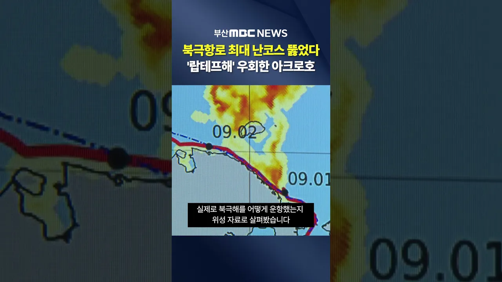

# 위성자료로 본 북극항로..′최대 난코스′ 뚫었다

## 기본 정보
- **URL**: https://www.youtube.com/watch?v=LBhbEA5ZncM
- **채널명**: 부산MBC뉴스
- **구독자수**: 24만
- **조회수**: 36,843
- **업로드일**: 2026-09-08
- **영상 길이**: 1:25
- **댓글 수**: 54
- **좋아요 수**: 1,178

## 썸네일

---

## 댓글 (추천순 TOP 10)

| 순위 | 좋아요 | 댓글 |
|------|--------|------|
| 1 | 72 | 우회한 코스가 있는데도 예상보다 일찍 도착한다는게 정말 대단한것 같다. 이런 성과가 널리 알려져야 하는데.. |
| 2 | 54 | 북극항로 선점해서 국가의 미래성장 동력이 되길 기대합니다, |
| 3 | 54 | 축하드립니다. 돌아오는길도 안전하게 돌아오세요 |
| 4 | 43 | 대단하다 다시 일어서는 부산 대한민국 만세 |
| 5 | 35 | 응원합니다  감사합니다  그리고  고맙습니다 |
| 6 | 20 | 역사적인 항로항해네요. 넘 감사합니다. 무사히 잘다녀오세요. |
| 7 | 23 | 응원합니다 사랑합니다 |
| 8 | 19 | 이렇게 일 잘하는 정부 지지율이 왜 이러냐고요 |
| 9 | 16 | 성공했네 북극항로로 운행하연 시일이 단축된다고 하든데 경제에 상당한 도움이 될것이다 |
| 10 | 7 | 북극항로 개척 대한민국~ 홧팅~❤❤❤ |
