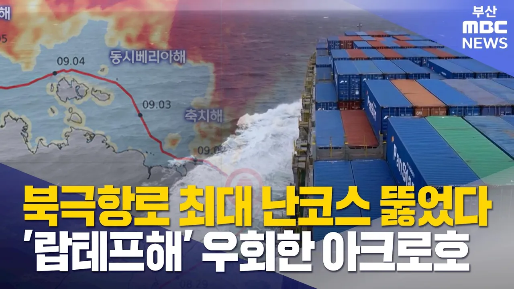

# 위성자료로 본 북극항로..'최대 난코스' 뚫었다 (2026-09-07,월/뉴스데스크/부산MBC)

## 기본 정보
- **URL**: https://www.youtube.com/watch?v=jZ3F1-lynys
- **채널명**: 부산MBC뉴스
- **구독자수**: 24만
- **조회수**: 432,461
- **업로드일**: 2026-09-07
- **영상 길이**: 2:04
- **댓글 수**: 458
- **좋아요 수**: 2,472

## 썸네일

---

## 댓글 (추천순 TOP 10)

| 순위 | 좋아요 | 댓글 |
|------|--------|------|
| 1 | 587 | 이 대단한 여정이 대대적으로 알려졌음 좋겠다 |
| 2 | 0 | 대단한 여정은 맞는데 경제성 없어요. 지금 화물 30%도 못실어서 정부에서 적자보존.  부정기선이라. 원활한 화물예약힘듬. 배 철판보강 개조하느라 무거워져서 일반배보다 기름10%이상 뎌 들어서 북극항로 외엔 쓸모없음. 연중 4개월만 쇄빙선 없이 항해가능한데 러시아 쇄빙선 붙으면 운임비 폭등. 그외에도 위험구간이라 보험료,선원단가 무지비쌈. 전쟁전 세계1~3위 해운사 운항포기. 우리나라도 메이저 해운사 들 아무도 입찰참여 안해서 중소해운사가 유일하게 입찰해서 중고컨테이너선 개조해서 운항. 근데 또 모르죠. 도전정신으로 나중에 잘될수도있고. 현재 중국만 즹기적으로 상업운항 중인데  러시아 쇄빙선 에스코트시 여러대가 뒤따르면서 단가 낯추는 것으로 판단됨. |
| 3 | 12 |  @레인보우7  미래를 보고 하는 사업이지 지금 당장을 보고 하는 사업입니까? 네팔 빙하 녹아서 홍수 난거 보면 미리 준비 하는게 맞는거 같은데 ㅎ |
| 4 | 0 | ​@streetkna7692 효율성 없는거 맞음 ㅋㅋㅋ 2700teu짜리가 800여개선적하고 출항.... 기착지 없이 바로 유럽으로... 여러항구를 들리며 하역할꺼하고 선적할꺼하며 다녀야하는데.... 그리고... 연비효율이 좋은 속도로 순항하지도 못하니 항차마다 연료비 부담만 늠ㅋㅋㅋ 그리고... 컨선은 스케줄에 맞게 기착지에 도착해있어야함 그렇지못함 언제 선적하역할지도 모르고 다음 스케쥴도 다 꼬임.. 북극항로.. 운항일정을 맞추겠음??? |
| 5 | 4 | ​ @레인보우7  10년 안에 얼음이 더 녹을거라 시간문제입니다. |
| 6 | 377 | 미래의먹거리 대단한 뉴스인데 언론들은 조용하네? |
| 7 | 18 | 😎어떡하던.이통.깎아내리는 뉴스만 전면 배치하고.있삼! 고런데.이런.뉴스 전할리가! 기득권.극우들의.단심은.어떡하던지.이통.탄핵시켜.쫓아내기임!  좋은.뉴스들은.국민들이.알아서.이리저리 퍼트려야! 동네방네! 😊 |
| 8 | 61 | 조중동 기래기들은 현 정부의 좋은 소식은 침묵하기로 담합했습니다.. |
| 9 | 11 | 정부 이미지 좋아지는 뉴스는 이 악물고 안 내보냄 ㅋㅋ |
| 10 | 36 | 조중동 언론, TK지역슬애기 챙겨야하서 조용... |
