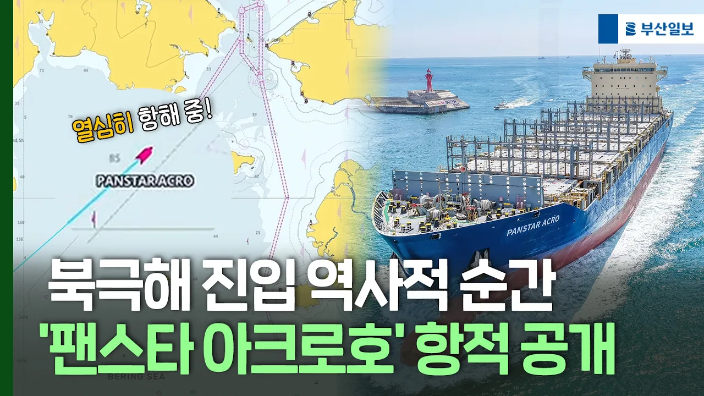

# 북극해 진입 역사적 순간...'팬스타 아크로호' 항적 공개

## 기본 정보
- **URL**: https://www.youtube.com/watch?v=QA1-fij7cdM
- **채널명**: 부산일보TV
- **구독자수**: 16만
- **조회수**: 41,587
- **업로드일**: 2026-08-31
- **영상 길이**: 1:02
- **댓글 수**: 27
- **좋아요 수**: 161

## 썸네일

---

## 댓글 (추천순 TOP 10)

| 순위 | 좋아요 | 댓글 |
|------|--------|------|
| 1 | 17 | 20일만에 간다고. 실제 보니 진짜 짧네 |
| 2 | 8 | 홍해로 가면 해적위험도 후티반군 위험  있고  2달 걸릴걸 20일만에 대단하네. |
| 3 | 0 | 안전운항 되시길 바랍니다 |
| 4 | 0 | 응원힙니다 무사히 잘 다녀오세요 |
| 5 | 18 | 돌아 올 때 노르웨이 고등어 잔뜩 좀 실어 오길. 계획 없었다면 샘플로 1 컨테이너만 냉동으로. 8월에 청정지역에서 대량으로 잡히는 노르웨이 고등어 맛이 좋다는데 |
| 6 | 2 | 연어도 추가 |
| 7 | 1 | 컨테이너선이라 불가능할거 같음 |
| 8 | 3 | ​ @레인보우7  냉동 컨테이너 실어서 전기만 꼽으면. 북극에선 전기도 필요없고 (혹시 조금만), 베링해로 넘어 와서 3-4일만 전기 꼽으면 |
| 9 | 0 | 응기래 운송비는 본인이 부담하시고 |
| 10 | 0 | ​ @더몬스터1993   가지고 들어 오면야. 9월에 싱싱한 청정해역 고등어, 부르는게 값 . 북극이니 냉동 비용 별로 안들고 |
