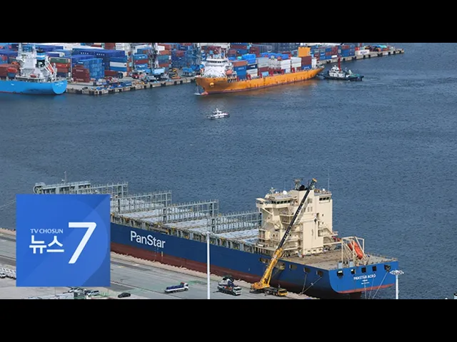

# 부산서 로테르담까지 1만3천km…'북극항로 시대' 여는 팬스타 아크로호 [뉴스7]

## 기본 정보
- **URL**: https://www.youtube.com/watch?v=IpU3Yh2IMEg
- **채널명**: 뉴스TVCHOSUN
- **구독자수**: 313만
- **조회수**: 4,162
- **업로드일**: 2026-08-22
- **영상 길이**: 1:48
- **댓글 수**: 5
- **좋아요 수**: 30

## 썸네일

---

## 댓글 (추천순 TOP 10)

| 순위 | 좋아요 | 댓글 |
|------|--------|------|
| 1 | 1 | 선장 월급 최소 2000만원…부럽 |
| 2 | 1 | 저긴 일반적인 루트가 아니니 당연히 그정도 받을 정도로 노련한 선장이 필요하지.. |
| 3 | 1 | 환경오염은 지구적 관점에서 2만킬로 운행하는게 더 심하지....하여긴 환경타령 하는 애들은 무지성임 |
| 4 | 1 | 환경오염 심각하겠네 벙커C유 매연 엄청심한데 |
| 5 | 4 | 북극항로 가는배는 벙커c유를 못싣게 되있습니다. |
