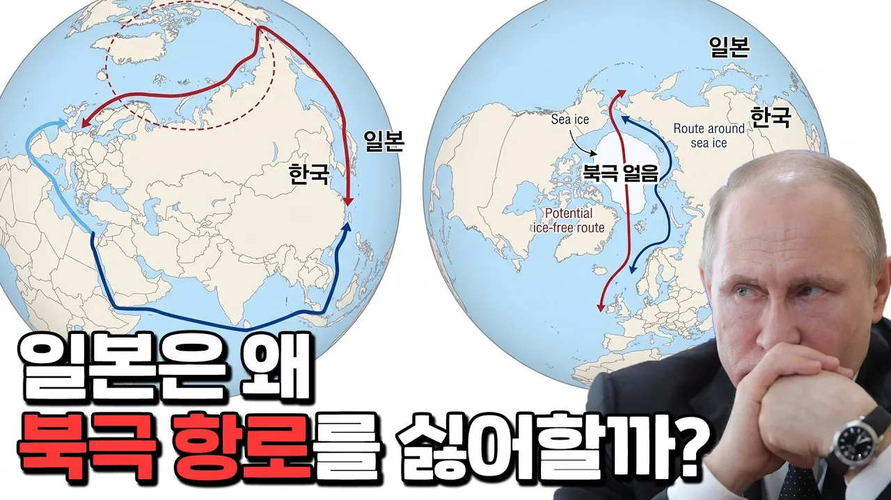

# 유럽으로 가는 더 빠른 길 북극 항로에 적극적인 한국과 소극적인 일본

## 기본 정보
- **URL**: https://www.youtube.com/watch?v=LFBEEft1uFc
- **채널명**: 슈카월드
- **구독자수**: 373만
- **조회수**: 1,120,482
- **업로드일**: 2026-09-12
- **영상 길이**: 28:31
- **댓글 수**: 1,000
- **좋아요 수**: 5,625

## 썸네일

---

## 댓글 (추천순 TOP 10)

| 순위 | 좋아요 | 댓글 |
|------|--------|------|
| 1 | 958 | 오늘 북극항로 시범운항 중인 팬스타 아크로호가 영국에 도착했다더라구요 딱 맞춰서 영상이 올라왔네요 굿! |
| 2 | 4 | 북극항로 개척 첫 성공 👏👏👏👏👏👏 |
| 3 | 21 | 30일이 20일로 단축되고 거리도 3분의1이 단축되는데 안갈이유가 없지 |
| 4 | 0 | ​ @고독하구만-f5y  적자임 |
| 5 | 0 |  @Damoor-x5m   초창기에는 당연히 적자지 시행착오없이 기술 발전할 리 없잖아 |
| 6 | 1 | 겨울엔 못갈껄.. |
| 7 | 35 | 10:19   큰배는 못간다고 했는데 오늘 팬스타 아크로호가 해냄 부산에서 영국까지 북극 얼음바다 뚫고 도착 |
| 8 | 10 | 설탕물 냄새는 유튜버가 잘 ... |
| 9 | 5 | 👍 |
| 10 | 8 | 아하 |
