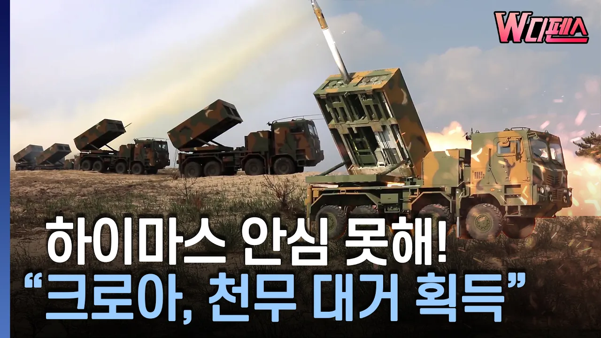

# [W디펜스] 하이마스 안심 못해! "크로아, 천무 대거 획득" / 머니투데이방송

## 기본 정보
- **URL**: https://www.youtube.com/watch?v=wrnP7lXxspI
- **채널명**: MTN 머니투데이방송
- **구독자수**: 119만
- **조회수**: 202,042
- **업로드일**: 2026-09-09
- **영상 길이**: 3:21
- **댓글 수**: 91
- **좋아요 수**: 928

## 썸네일

---

## 댓글 (추천순 TOP 10)

| 순위 | 좋아요 | 댓글 |
|------|--------|------|
| 1 | 34 | 천무가 대단하긴 하다보다. 대한민국  파이팅 |
| 2 | 27 | 이러다가 천무대 천무로 싸우는 전쟁도 보겠네 ㅋㅋㅋㅋㅋㅋ |
| 3 | 5 | 그보다는 중국산 무기로 무장한 세르비아와 러시아 상대로 싸우겠지. |
| 4 | 0 | @Dexter_Nim I dont thik Korea would purchase Chunmoo to country with Chinese radars, air defence systems, missiles, where China have big influence. They would study Chunmoo, serbs would let them to do that. |
| 5 | 17 | 하이마스을 신속하게 운송할 대형수송선이 없다면 ....천무가 답이지... 화력도 두배인데... |
| 6 | 6 | 나이스하네!!!!! |
| 7 | 1 | 고갱님 !!  탁월한 선택이십니다 ~ |
| 8 | 2 | 발사대보단 공격형 무기의 보급 속도가 중요하다는 것을 알게 된 것이지. |
| 9 | 3 | 이제 제값받고 배짱장사 좀 해보자.... 프랑스 반만 따라해보자 |
| 10 | 2 | 이렇게 무기들을 비축하면 반드시 쓰게 되는데, 정말 여기저기서 전쟁 나겠구나... |
