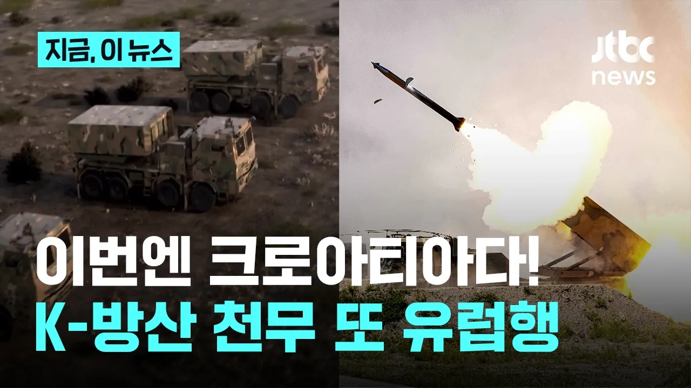

# 이번엔 크로아티아로…한화에어로, 6000억 규모 천무 수출｜지금 이 뉴스

## 기본 정보
- **URL**: https://www.youtube.com/watch?v=eaACWaY31PU
- **채널명**: JTBC News
- **구독자수**: 490만
- **조회수**: 116,030
- **업로드일**: 2026-09-04
- **영상 길이**: 1:30
- **댓글 수**: 91
- **좋아요 수**: 397

## 썸네일

---

## 댓글 (추천순 TOP 10)

| 순위 | 좋아요 | 댓글 |
|------|--------|------|
| 1 | 70 | 한화 에어로스페이스 자랑스럽습니다 화이팅 |
| 2 | 77 | 유럽에 우리 방산 쫙 깔아라!!! |
| 3 | 0 | 우크라 빼고 |
| 4 | 18 | 탁월한 선택... |
| 5 | 39 | 70년전에 탱크한대도없던나라가 전세계에 무기팔아먹고있다 ㅋㅋㅋㅋ |
| 6 | 7 | 사실 조선 후기부터 해서 망국으로 치닫던것 뿐이지 전통적으론 그렇게 약소국이나 가난한 나라는 아니긴 했죠 임진왜란때도 해전으로 일본군을 압도하기도 했고 고려때는 송이 북방민족을 견제하기 위해 고려를 꽤 대접하기도 했죠 삼국시대나 발해는 말 할것도 없고..근현대에 외국으로부터 자본과 기술을 받기도 했지만 기본적인 토대가 있었기에 가능했던게 아닌가 싶습니다. |
| 7 | 2 | 대단하다 대한민국 |
| 8 | 0 | 첫 댓글 분이 잘 말씀해주셨는데 사필귀정이라고 원래 한국은 고대로부터 선진국이었으니 다시 선진국으로 가고 있는 겁니다 |
| 9 | 7 | 우리 젊은이들 공대생들 일자리 많이 생기길~~😊😊 |
| 10 | 15 | 대한민국 만세~~~~~~~~~~~~~ |
