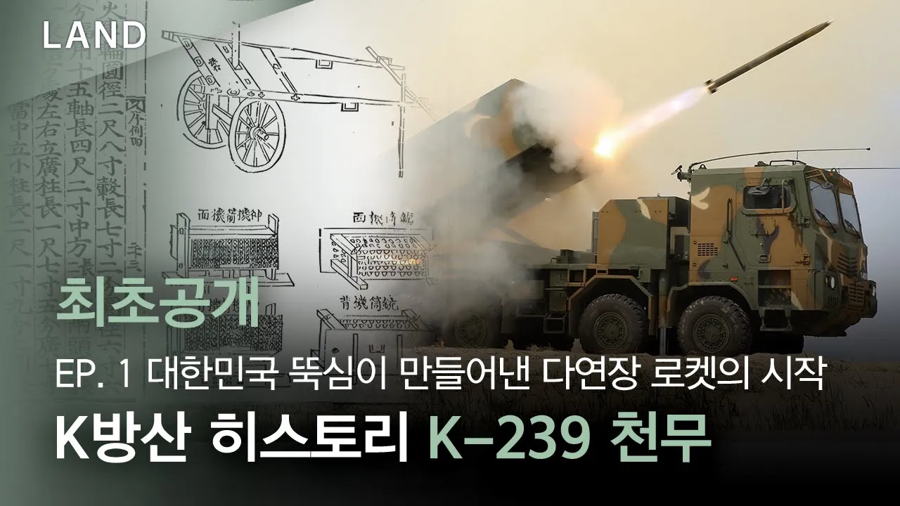

# K방산 히스토리 – 대한민국 뚝심이 만들어낸 다연장 로켓의 시작

## 기본 정보
- **URL**: https://www.youtube.com/watch?v=coqXv8f_83w
- **채널명**: 한화에어로스페이스
- **구독자수**: 4만
- **조회수**: 326,025
- **업로드일**: 2025-04-06
- **영상 길이**: 14:04
- **댓글 수**: 17
- **좋아요 수**: 3,289

## 썸네일

---

## 댓글 (추천순 TOP 10)

| 순위 | 좋아요 | 댓글 |
|------|--------|------|
| 1 | 0 | 지금의 한화는 수많은 직원들의 노고가 있음에 가능했었네... 정말 작은거 큰거 하나하나가 다 모여서 방산대국이 이뤄진듯... |
| 2 | 9 | 정직기업 한화 ᆢ김승연회장님 ⭐️  안녕하세요. 사랑합니다 ᆢ🏝 |
| 3 | 11 | 한화 ᆢ쑥쑥 ~~~⭐️ |
| 4 | 4 | 잘했네😂1❤🎉 |
| 5 | 9 | 한화 ᆢ김동관부회장님 ⭐️  사랑합니다. 감사합니다 ᆢ🏝 |
| 6 | 5 | CTM-MR 로켓의 길이 늘려서 사거 연장 해 주세요. |
| 7 | 3 | ㄷㄱㅈ~~😊 |
| 8 | 0 | 축하드립니다🎉🎉 허무맹랑할지는 모르겠지만 새로운 전투기용 미사일 생각해봄.미사일 원기체에 양옆에 미사일을 추가로 2개 달아서 날아가다 어느 순간 3개에 미사일로 변하는 분리 로켓 미사일.가능할거 같은데 개발 가능하신가요?만약 이게 된다면 전투기에 미사일 많이 안 실는 6세대 전투기에 탑재하기도 좋고 공중전에 판도를 바꿀거 같은 생각이듬. |
| 9 | 0 | 구룡 2 드론 을 쏘는 거야. |
| 10 | 4 | [히스토리 모아보기]
 천무, 유럽에서 첫 실물 공개… 한화, ‘유로사토리 2024’ 참가
 👉: https://bit.ly/3RLqTIP
 한화에어로스페이스, 폴란드와 천무 72대 계약
 👉: https://bit.ly/3VHcezF
 한화, 폴란드 방산전시회 참가…유럽 특화 ‘육•해•공 솔루션’으로 시장 정조준
 👉: https://bit.ly/3zaPYWU |
