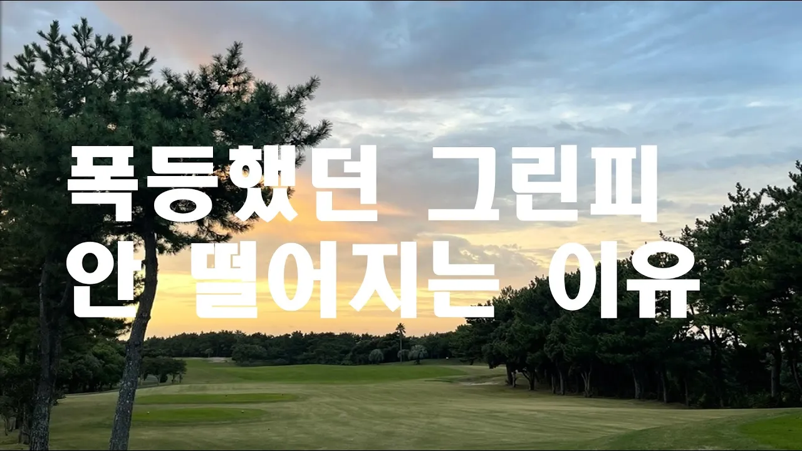

# 폭등했던  그린피 왜 안 떨어질까? 그 이유는

## 기본 정보
- **URL**: https://www.youtube.com/watch?v=F9flXWSkq_s
- **채널명**: 말로버디
- **구독자수**: 2만
- **조회수**: 3,538
- **업로드일**: 2025-03-27
- **영상 길이**: 8:44
- **댓글 수**: 5
- **좋아요 수**: 34

## 썸네일

---

## 댓글 (추천순 TOP 10)

| 순위 | 좋아요 | 댓글 |
|------|--------|------|
| 1 | 1 | 잠재적 수요, 마약과 같은 운동~ 정확한 지적이시네요  ㅎ 골퍼 스스로 합리적인 소비만 한다면 호구 왔는가~라는 말은 없어질텐데요  ㅎ |
| 2 | 0 | 골퍼들의 합리적인 소비가 필요할때인것같습니다~~^*^ |
| 3 | 1 | 그린피도 그린피지만 캐디비와 카트비.... 운영의 목적으로 필요한 요소들인데 소비자가 택일을 할수 없이 무조건의 사용으로 부담이 더 되는 것 같습니다.. |
| 4 | 0 | 골퍼들이 선택할수잇는 시기가 곧오리라 생각돕니다 |
| 5 | 1 | 호구 되시는데 와이 내려  안가면 됨 비싸도 년중 행사로 외국 간다 |
