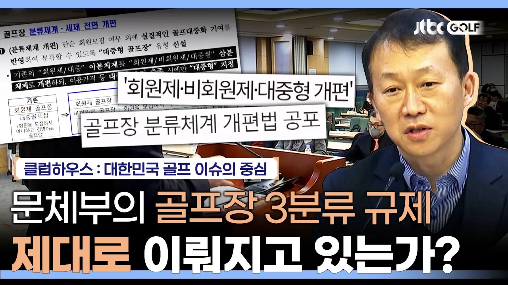

# 6개월이 지난 골프장 3분류 규제 시행, 그린피가 비쌀 수 밖에 없던 근본적 이유? | 클럽하우스

## 기본 정보
- **URL**: https://www.youtube.com/watch?v=A6QkfA37Suc
- **채널명**: JTBC GOLF
- **구독자수**: 49만
- **조회수**: 27,151
- **업로드일**: 2024-04-03
- **영상 길이**: 14:54
- **댓글 수**: 67
- **좋아요 수**: 132

## 썸네일

---

## 댓글 (추천순 TOP 10)

| 순위 | 좋아요 | 댓글 |
|------|--------|------|
| 1 | 31 | 법규랑 전혀 상관없이 지금기준 눈치 빠른 골프장들은 할인이라는 이름으로 내려가고 있는데, 안가면 떨어지는 결론. 다들 그냥 해외로 갑시다. |
| 2 | 16 | 왜 세금으로 골프장에 배불려 주는가?? |
| 3 | 19 | 법인카드 경비처리 안해주면 금방 반값으로 내려간다. 일본의 경우를 봐라 |
| 4 | 13 | 아무튼 올해는 "그린피"가 좀 내려갔으면 좋겠네요 ㅠㅠ |
| 5 | 7 | 카터비 그린피 캐디피 말도안되는 가격,,, 우리 전부 해외로나가 골프즐기도록하자!!! |
| 6 | 17 | 그린피도 문제지만 카트비도 터무니없이 비쌉니다. 1인당 만원수준이면 적당합니다. 지금 팀당 10만원 이상은 지나칩니다. |
| 7 | 8 | 소비자 보호법은 왜 골프장에는 적용이 안되는가?  비가와도 일단 가서 최소하고 와야하고 턱없이 준비가 안된 골프장이 그린피는 다 받는가 하며 코스 컨디션과 상관없이 그린피는 정상가를 받는 몰지각한 업주들 |
| 8 | 13 | 완전 바가지 골프장 |
| 9 | 6 | 세금 다시 올려야함   골퍼는 줄고  세금은 늘고 ..  그린피 ? 여기서 더이상 못올림 |
| 10 | 7 | 지방에 있는 골퍼들은 정부가 만든 체시법때문에 역으로 피해를 보고있는 상황입니다. 정부에서 정한 그린피 가격 기준때문에 지방 골퍼들이 더 불이익을 받는다는 사실을 모르고 계시나요? |
