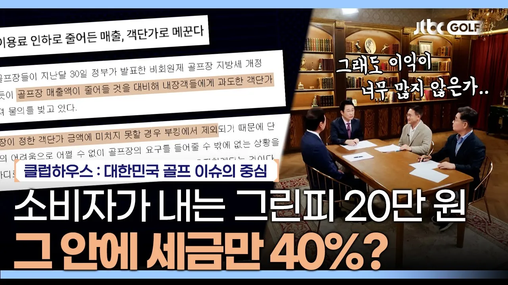

# 그린피가 20만 원이나 되는 이유가 세금 때문이다?💸｜클럽하우스

## 기본 정보
- **URL**: https://www.youtube.com/watch?v=W4oHlqLrp2k
- **채널명**: JTBC GOLF
- **구독자수**: 49만
- **조회수**: 11,261
- **업로드일**: 2025-10-14
- **영상 길이**: 23:29
- **댓글 수**: 80
- **좋아요 수**: 95

## 썸네일

---

## 댓글 (추천순 TOP 10)

| 순위 | 좋아요 | 댓글 |
|------|--------|------|
| 1 | 10 | 정부는 골프장에 세금 감면하지 말고 과세해라.  그린피가 얼마나 올라 가는지 함 보자.  골프 안가도 된다. |
| 2 | 8 | 사람 안오면 내려갑니다. 논의할 게 뭐 있나 싶네요. 시장경제가 그런 것을.. 세금 못버티면 폐업할꺼고.. 그냥 냅두면 됩니다. |
| 3 | 10 | 여기에 카트비가 빠지면 안됩니다. 카트비는 한번 구입한 카트로 수년간 큰 투자비없고 정비및 전기비 빼더라도 상당부분 수익입니다. |
| 4 | 0 | 골프카트 14만원기준잡고 최소하루1바리운행한다잡고 365일5100 만원. 엄청난 부가수입이죠. 카트하나신품2000이하일건데.  피도약한거아니고. |
| 5 | 17 | 분명히 다음날 비 예보가 있는데 취소가 안 되는건 뭐지? 집에서 출발 할때도 비가 내리는데 골프장은 비가 안 온단다, 시발 좁은 땅덩어리에 골프장만 비가 안 오나? 가서 보면 비가 내려, 그래서 물었더니 현장취소만 된단다. 시발 우천 취소 하려고 한시간 넘게 운전하고 이거 갑질이지 뭐냐? |
| 6 | 2 | 7.8월  손님없다   거짓말이야  ~~ |
| 7 | 0 | 골프장까지 오는 동안 희박한 확률로라도 비가 그치면 그거라도 주워먹으려고 ㅎㅎㅎ |
| 8 | 3 | 안가면 망하지 않으려고 내리겠지 그냥 안가는게 답이다. |
| 9 | 6 | 카트피.  없애야함 |
| 10 | 4 | 세금혜택 주는 대중골프장이  왜 필요해? 국민에게는 아무 도움도 안되는데. 아무리 좋은 취지의 법이나 규정도  어떻게든 사기술로 교묘하게 이용해서  지들만 배 체우려고 하는데  그냥 차라리 전부 세금이라도  팍팍 먹여라. |
