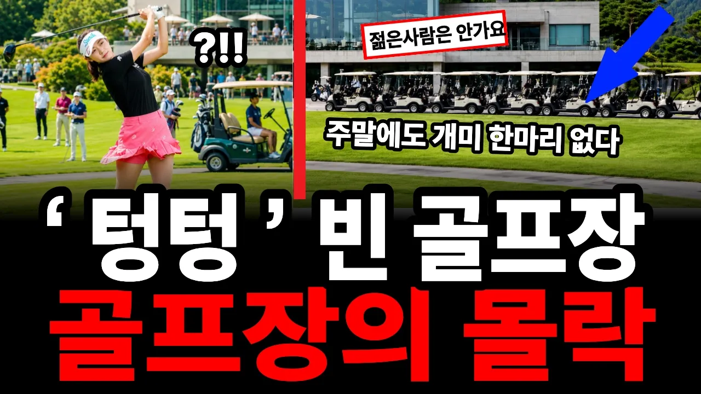

# "그린피는 내렸다는데" 주말에도 텅텅 빈 골프장이 몰락하는 진짜 이유

## 기본 정보
- **URL**: https://www.youtube.com/watch?v=IOQlAXRVbQQ
- **채널명**: 원초적심리경제학
- **구독자수**: 6,130
- **조회수**: 207,662
- **업로드일**: 2026-08-26
- **영상 길이**: 20:39
- **댓글 수**: 140
- **좋아요 수**: 1,054

## 썸네일

---

## 댓글 (추천순 TOP 10)

| 순위 | 좋아요 | 댓글 |
|------|--------|------|
| 1 | 34 | 한여름에만 더워서지, 아직도 성업중, 절대가격 안 내려, 카트비부터 없애라 |
| 2 | 32 | 미친소리..주말에 거의 풀북이다 |
| 3 | 15 | 부산에 진해신항골프장(36홀)  손님이 거의 없는데가격 안 내린다. 그냥 망해라. |
| 4 | 68 | 무슨소리야 아직도골프장배짱영업이고 그린피하나도안내렸다 |
| 5 | 1 | 그리피가아니라 캐디피, 카트비 주기 싫어서 안간다. 그린피에서 카트비와 캐디피를 분리시키는 것은 범죄이다 |
| 6 | 31 | 무슨소리 오늘도 풀팅이구만 |
| 7 | 49 | 아니 이런방송하는 자들은 골프장 가보고 하는소린가~? 욕나오는거 참소~😅 |
| 8 | 2 | 유투브 낚시질에 낚인거다 😊 |
| 9 | 9 | 제발 캐디 없애라니까 |
| 10 | 14 | 전체적인 얘기만하세요. 수도권이나 경기도는 아직도 호황입니다. |
