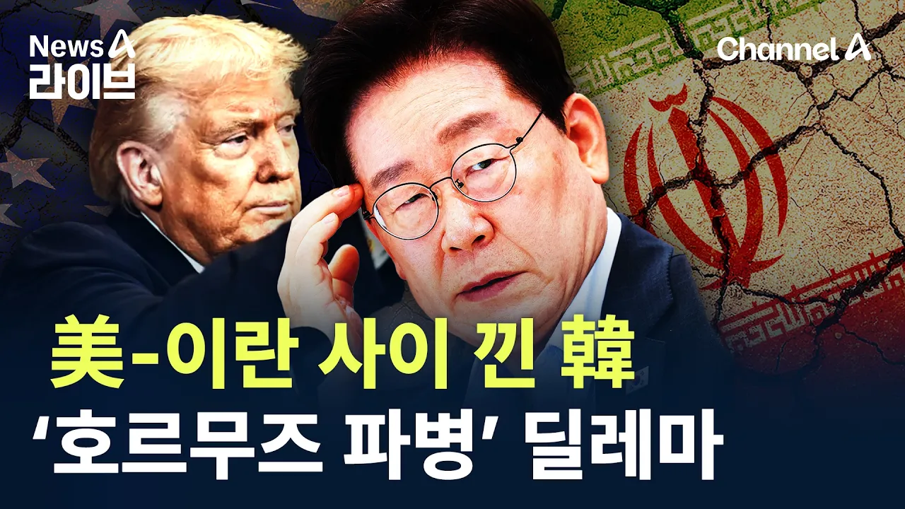

# 미국-이란 사이 낀 한국…‘호르무즈 파병’ 딜레마 / 채널A / 뉴스A 라이브

## 기본 정보
- **URL**: https://www.youtube.com/watch?v=IZ8fH--UPC8
- **채널명**: Channel A News (Korea)
- **구독자수**: 350만
- **조회수**: 17,382
- **업로드일**: 2026-09-07
- **영상 길이**: 8:50
- **댓글 수**: 122
- **좋아요 수**: 71

## 썸네일

---

## 댓글 (추천순 TOP 10)

| 순위 | 좋아요 | 댓글 |
|------|--------|------|
| 1 | 4 | 재명아 닥치고 있어걍 어차피 트럼프 곧있으면 일반인된다 |
| 2 | 2 | 젊은이들 목숨 팔아서 뭘 얻을려고? |
| 3 | 12 | 규백이 보내라❤ |
| 4 | 0 | 갔음 |
| 5 | 0 | ​ @cegabanadol 전쟁 보내라고 |
| 6 | 0 | 가다가 탈영해서 안됨 |
| 7 | 0 | ​ @james_alice ㅋㅋㅋㅋ |
| 8 | 2 | 미국 철수 시켜드라도  파병하면  죽어도  안된다~ |
| 9 | 2 | 절대 파병하지마라 정말 큰실수 하는거다 나라 경제 파탄난다 앞으로도 상황 더안좋아 지는거고 |
| 10 | 3 | 미국이 성공하고 있으면  도와달라하겠어  실패하고있으니 도와달라지 언론들이 미국편드는 말만해 사기꾼들처럼 얼굴에 철판을 깔고하는 뻔한질문과 뻔한응답을 보수언론이 떠들지마라 침략전쟁이야! 수준떨어진다 |
