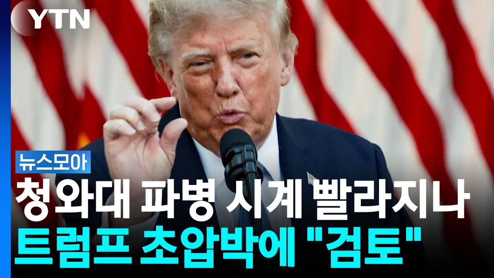

# "미국만 책임질 수 없다" 한국 향한 호르무즈 파병 압박 [뉴스모아] / YTN

## 기본 정보
- **URL**: https://www.youtube.com/watch?v=_FUUe_02OYQ
- **채널명**:  YTN
- **구독자수**: 541만
- **조회수**: 29,742
- **업로드일**: 2026-09-07
- **영상 길이**: 46:20
- **댓글 수**: 150
- **좋아요 수**: 154

## 썸네일

---

## 댓글 (추천순 TOP 10)

| 순위 | 좋아요 | 댓글 |
|------|--------|------|
| 1 | 47 | 자기가 싼 똥은 자기가 치워야지  유가불안 피해만 해도 엄청난데, 어이가 없네 |
| 2 | 21 | 트럼프가 싸지른 똥을 왜 우리가 치우러 가나?  싼놈이 처리해야지. |
| 3 | 23 | 지가 저지른전쟁 지가 책임져야지 남에게 방패막이  되라고  지룰이야 |
| 4 | 26 | 버텨라 중간선거지나면 부정선거 음모론 나오고 계엄까지 탄핵까지 .. |
| 5 | 10 | 미국 은. 절대로 아니다 우리나라 를  전쟁으로 몰아가고있다 |
| 6 | 31 | 절대불가! 트럼프야 지나가는 인간이나 우리가 감당할 후과는 크고 오래갑니다. |
| 7 | 16 | 침략전쟁을 일으킨 나라가 그침략의 댓가를 치르는게 당연하지 우릴 왜 끌여들여 침략전쟁 파병 반대 한다 |
| 8 | 21 | 파병할수없다 |
| 9 | 0 | ㅎㅎㅎ 결국 파병된다 |
| 10 | 8 | 지네 군인은 참전 안하면서 우리나라만 파병하라고? |
