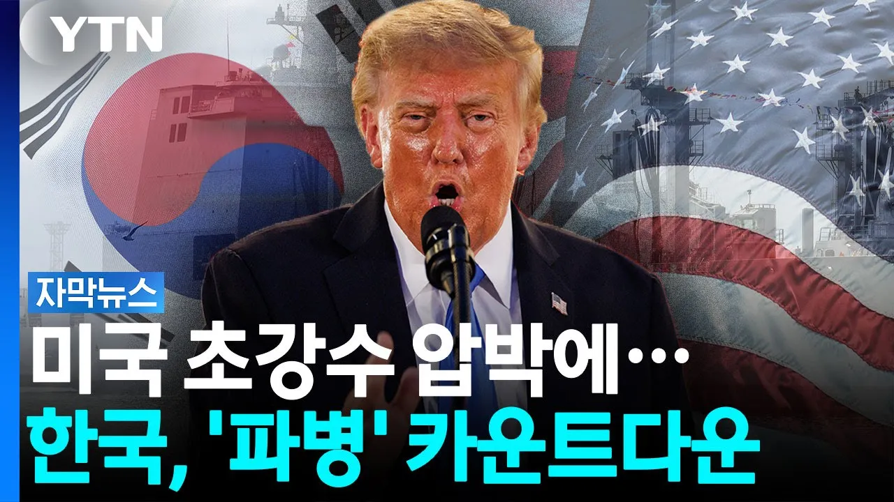

# 결국 내몰린 한국...호르무즈 군대 보내나 [자막뉴스] / YTN

## 기본 정보
- **URL**: https://www.youtube.com/watch?v=BOcyLFkk7es
- **채널명**:  YTN
- **구독자수**: 541만
- **조회수**: 27,736
- **업로드일**: 2026-09-07
- **영상 길이**: 1:54
- **댓글 수**: 358
- **좋아요 수**: 174

## 썸네일

---

## 댓글 (추천순 TOP 10)

| 순위 | 좋아요 | 댓글 |
|------|--------|------|
| 1 | 140 | 지네나라 국민들한테도 이 전쟁이 대체 왜 해야만 했는지 기본적인 설득조차 못하고 있으면서 다른나라한테 파병을 요구해? |
| 2 | 1 | 명분이 핵이랑 독재라고 ㅋㅋㅋㅋ  그걸 편드는 얘들  악의 축이라고 하더라 ㅋㅋㅋㅋ  미국이 만든 기준으로! |
| 3 | 0 | 우리는 이란 호르무즈 해협을 봉쇠해서 석유길이 막혀 석유, 전기 없이 망하게 생겼으니 우리가 석유길을 지키는 것이 1찍들이 말하는 국가의 자주국방의 핵심임 ㅋㅋㅋㅋ 석유없이 자주국방이 가능함? |
| 4 | 4 |  @doom9344  응 알겠으니 너가 파병 가 |
| 5 | 3 | ​ @doom9344  원래 뚫린 길을 미국이 이란 침공해서 막힌거지. |
| 6 | 0 |  @PJB-j2w  호르무즈 처음 봉쇄한게 이란임 ㅋㅋㅋㅋ 그걸 푸르라고 하는건 미국이고 ㅋㅋㅋ |
| 7 | 2 | ​​​ @doom9344  미국이 주도했고 걸프국가들이 사실상 참전한 침략전쟁이니 이란이 봉쇄한거임. 우리 입장에선 엿같지만 침략전쟁 일으킨 미국에게 대부분 책임이 있음. |
| 8 | 142 | 미친놈들 전쟁은 생각없이 시작하고 이제 어려우니 도우라? |
| 9 | 1 | 베네수엘라 석유도.. 트럼프 정부는 지금.. 자기 석유처럼 퍼다 쓰고 있다.. |
| 10 | 0 |  @Bryan_hajoon 이런 사람이 을사 늑약도 협정이라 할 사람임.. 앞잡이 집안일 확율이 높음.. |
