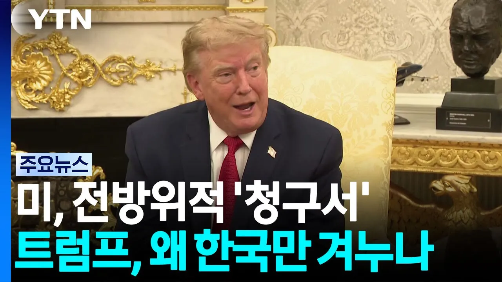

# 파병·천궁·반도체 압박...트럼프는 왜 유독 한국만 겨누나 / YTN

## 기본 정보
- **URL**: https://www.youtube.com/watch?v=dU3ndUvM1u8
- **채널명**:  YTN
- **구독자수**: 541만
- **조회수**: 16,464
- **업로드일**: 2026-09-08
- **영상 길이**: 2:11
- **댓글 수**: 119
- **좋아요 수**: 43

## 썸네일

---

## 댓글 (추천순 TOP 10)

| 순위 | 좋아요 | 댓글 |
|------|--------|------|
| 1 | 13 | 미국한테 한국은 동맹이 아니라 말잘듣는 호구임 |
| 2 | 0 | 한국 여성 사귀고싶은 국가 이성 1위 중국 2위 유럽은 뭐지? |
| 3 | 0 | 선관위가 국가에 테스트 시험 받고 면허 받은 (앱손사에 잉크젯)프린터를 쓰는데 프린터 삼성A/S 전화번호 고객센터 및 삼성전자 홈페이지에 잉크젯 프린터의 작동 원리는 빨,노,파 잉크를 3개의 노즐에서 미스트 형태로 분사해서 빠르게 순식간에 증발 시키며 리모컨에 빨강 노랑 파랑 버튼이 있으면 2~3개 버튼을 동시에 3초이상 길게 누르는데 있음. 그렇게되면 공기중에 수분이 2~3배 3가지 섞이며 농도가 올르지만 미스트=수증기라서 빠르게 잉크가 말른 상태로 인쇄됨. 선관위가 종이를 아무리 비틀어도 공기중에 서로 다른 색상의 중금속이 미세단위로 분리가 불가능함. |
| 4 | 0 | 선관위 변호 중인 선관위 국조특위 위원장 윤상현 그라운드C랑 전한길한테“부정선거 말은 입밖애도 꺼내지마라”협박.윤상현 한중의원소속, 한중도시우호협회고문,중국 간첩으로 구속되었던 동방명주 왕해군 정치인사들과 교류 끈근, 특히 윤상현이 대표적 , 민주당 김두관 등/ 왕해군 간첩혐의로 검찰이 구속 시켰지만 당시 민주당이 간첩법을 갸정시켜놓지 않아 제대로된 수사도 없이 흐지부지 끝남 |
| 5 | 3 | 인류사에 남는 사기꾼 트럼프는 요구사항을 들어줘도, 끝없이 갑질을 하기 때문에 파병을 해도 아무 의미가 없다. |
| 6 | 9 | 우리가 일본의 식민지로 전락했던 이유 중 가장 중요한 원인은 일본과 미국이 맺었던 가쓰라태프트밀약때문이었다. 한국전쟁도 미국이 한국을 애치슨라인에서 제외했기 때문이며, 역사를 망각한 매국적 친미사대주의자들은 미군은 이 땅에서 수만명이 죽었고 그래서 호르무즈 파병으로 은혜를 갚아야 한다고 말한다. 하지만 애치슨라인에서 제외된 결과 한국전쟁이 일어났고 한국민 오백만명이상이 사망했으며, 이산가족이 이천만명이며, 국가가 분단되었다. 그럼에도 한국전쟁 도와주었으니 한국도 미국을 도와야 한다고 한다. 어찌보면 피가 거꾸로 솟을 일이다. 물론 재건과정에서의 원조는 많은 도움을 주었지만 병주고 약준 것이다. 미국의 요구로 월남전에도 파병하였고 5000명 이상의 사망자와 두배이상의 부상자를 기록하였다. 또한 이라크전에도 파병하였으며, 사드배치의 결과 대중국 피해액이 10조원을 돌파하였으며 중국에서 금한령이 내려졌고, 태극기가 찢겨지고 한국인들이 폭행당하고 많은 기업들이 피해를 입었다. 그리고 지금은 이란파병을 강요하고 있으며, 3500억달러의 투자와 관세, 대한민국의 먹거리 반도체공장을 미국으로의 이전하라는 요구를 하고 있다. 반도체호황으로 인한 금년도 반도체 수출액은 4000억달러 이상이 될 것이다.반도체로 인한 수백조원의 낙수효과와 고용창출이 미국으로 떠나면 대한민국이 어떤 모습이 될지 상상하기 조차 싫다. 우리도 미국에게 할만큼은 했다. 지금 미국은 동맹이 아니라 한국에 빨대를 아주 깊게 꽂고 있다는 것을 알아야 한다. |
| 7 | 19 | 우리도 캐나다처럼 나갈 필요가 있다. 정신차려야한다. 어떻게든 동맹국들한테 전쟁 책임전가 시키고 지는 선거에서 이겨먹을라고 잔머리 굴리는거다 저거 |
| 8 | 8 | 딴놈들은 건드리면 수습하기 힘드니 한국만 족치자 이넘들은 너무 쉬어 ~ |
| 9 | 16 | 내가 볼땐 핵에 대한 언질을 줬기때문에 저러는듯. 핵 가지고 싶으면 알아서 잘해라 이거지 저 양아치는 핵무장 약속해 놓고 뒤통수칠 놈이다 미국을 믿지 마라! |
| 10 | 0 | 미국이 아니라 트럼프를 믿으면 안됨 공화당도 트럼프 믿고있다가 지금 머리 터질지경임ㅋㅋ 거역하면 트럼프한테 역풍 올 거고 그렇다고 트럼프 하라는 대로 하면 선거 폭망이 보이니 ㅋㅋㅋㅋㅋㅋㅋ |
