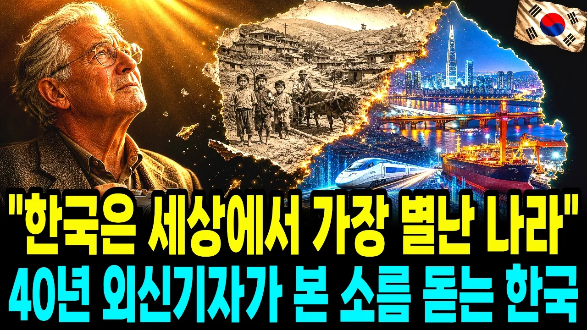

# "전 세계 어디에도 이런 민족은 없습니다" 40년 묵은 외국기자가 본 잿더미 속에서 세계 최강국이 된 한국인들의 가장 소름 돋고 위대한 특징

## 기본 정보
- **URL**: https://www.youtube.com/watch?v=lHG5O46YaOI
- **채널명**: 경제담론
- **구독자수**: 1만
- **조회수**: 21,442
- **업로드일**: 2026-09-08
- **영상 길이**: 27:13
- **댓글 수**: 16
- **좋아요 수**: 226

## 썸네일

---

## 댓글 (추천순 TOP 10)

| 순위 | 좋아요 | 댓글 |
|------|--------|------|
| 1 | 2 | 은근과 끈기의 민족! 밥은 굶어도 자식 공부는 끝까지 포기 안하는   끈질긴 민족입니다. |
| 2 | 2 | 대한민국 퐈이팅! |
| 3 | 1 | 대한민국 화이팅 🎉 |
| 4 | 1 | 화이팅!!!! |
| 5 | 0 | 조선소도 없이 차관을 따내고 만들지도 않은 배를 팔았던 정주영회장님,정말 존경합니다! |
| 6 | 1 | 82년도에 그 정도는 아니었다. |
| 7 | 0 | 수출기업 힘내세요 |
| 8 | 1 | 대한민국 파이팅😂😂😂😂😂😂😂😂😂😂🎉🎉🎉🎉🎉🎉🎉🎉🎉🎉🎉🎉🎉🎉🎉🎉🎉🎉🎉🎉. |
| 9 | 0 | 한마디로 박정희~~이분께 경의를 표합니다~~😊😊😊 |
| 10 | 0 | 대한민국 홰이팅❤️ |
