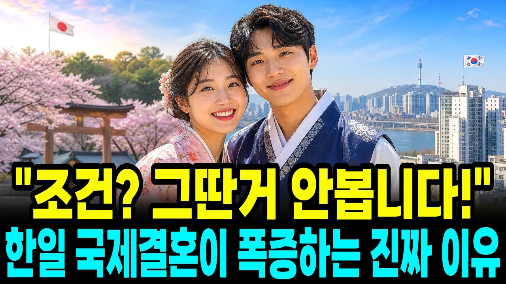

# "조건 안 봐요! 한국남자면 됩니다" 일본 여자들이 한국 남자와 결혼하려고 줄을 서는 진짜 이유

## 기본 정보
- **URL**: https://www.youtube.com/watch?v=OE8LIDbLdJM
- **채널명**: 경제담론
- **구독자수**: 1만
- **조회수**: 12,361
- **업로드일**: 2026-09-04
- **영상 길이**: 27:36
- **댓글 수**: 16
- **좋아요 수**: 121

## 썸네일

---

## 댓글 (추천순 TOP 10)

| 순위 | 좋아요 | 댓글 |
|------|--------|------|
| 1 | 2 | "남편 돈 쓸 때마다 죄책감이 들어"  어느 한국남자 일본여자 국제커플 유튜브 채널의 아내 분이 제목에 쓰신 말 |
| 2 | 3 | 한국여자들의 문제점 해줘도 끝없이 요구 책임은 뒷전 남과의 끝 없는 비교 그걸 당하는 한국남자... |
| 3 | 0 | 한국 남 여 젊은이가 어느 나라 사람을 만나 가정을 이루던 한국인으로서의 정체성을 간직하고 살기 바랄 뿐이다. |
| 4 | 3 | 우리나라는 돈 만이 문제가 아니라는 거 아실거라 봅니다 이 흐름은 막을 수 없습니다 기득권 세력들이, 이 때까지 받던 특권을 자발적으로 내려놓을까요? 우리나라 여성진들이 그렇게 현명하게 행동하던가요? 법이 개판인 다른 나라들도 남자들이 연애 결혼 안합니다. 세상이 작정하고 같은 나라 사람끼리 연애 결혼 하지 말라 하는데 어떻게 하나요? |
| 5 | 0 | 고무적인 현실입니다 |
| 6 | 2 | 자료가 언제적인가? 1인당 gdp  모르면 지금당장 다음 네이버가서 확인 해라 |
| 7 | 0 | 다 떠나서 이웃끼린 인사하며 살자 인사를 하면 서로 편안함을 느끼고 그 이웃이 나를 불편하게 해도 조금은 아주 조금은 완와 될껀데....예전엔 이웃사촌 이란 말도 있는데 이웃은 사촌이다 ㅎㅎ 한국문화의 힘은 이런 정 에서 나오는거 같은데.... 댓글 읽고계신 사촌분 "안녕하세요" 오늘하루 힘들어도 화이팅 해요~ |
| 8 | 0 | 성 만 바꾸는데 무슨 이름을 바꾼다고 하는지 모르겠군. |
| 9 | 0 | 국내 국외 누구와 결혼 해도 이혼율 1위인 여자가 한국여자 😂😂 |
| 10 | 0 | 왜는 화근이요. 저주받고 천벌받는다 |
