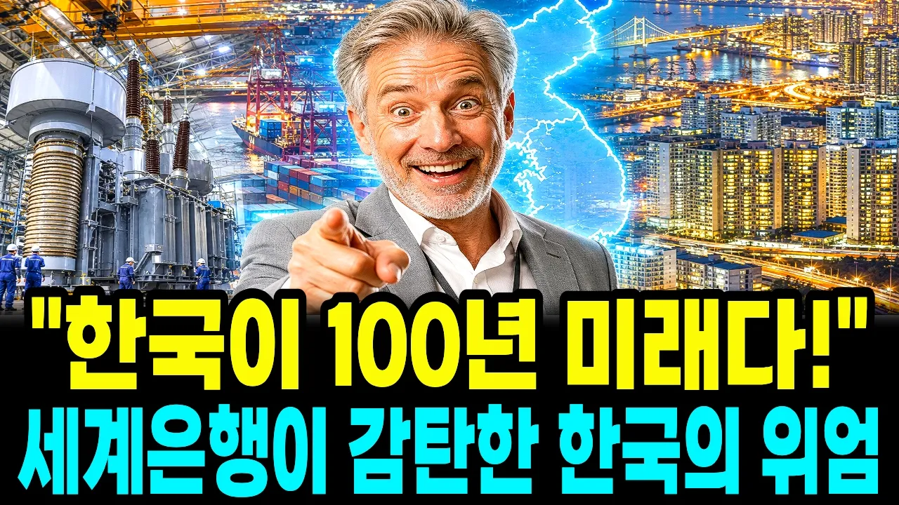

# "인류의 미래를 이 작은 나라에 쏟아부었다" 선진국조차 흉내 낼 수 없는 한국 최첨단 인프라의 경이로운 수준

## 기본 정보
- **URL**: https://www.youtube.com/watch?v=SOr9xlGmuAc
- **채널명**: 경제담론
- **구독자수**: 1만
- **조회수**: 33,795
- **업로드일**: 2026-09-02
- **영상 길이**: 27:01
- **댓글 수**: 5
- **좋아요 수**: 186

## 썸네일

---

## 댓글 (추천순 TOP 10)

| 순위 | 좋아요 | 댓글 |
|------|--------|------|
| 1 | 1 | 1960년의 소득이 1200달러가 아니고 약87달러 정도 일거예요. 제발 숫자를 이야기 할때는 꼭 한번더 점검해 주어서 고객의 신뢰를 얻길 바랍니다. |
| 2 | 0 | 행복한 그곳이 인류의 미래입니다. 그곳은 벌거 벗고 초원을 달리던 아득한 과거가 인류의, 우리의 미래가 될 수 있습니다. |
| 3 | 0 | 정치를 잘 했다면 모든산업 기반시설이잘되어있는 대한민국! 이것은아니다고 봅니다. 정신차려야 삽니다. |
| 4 | 0 | 전기요금을 3%정도 인상.지하철도 공짜는 없애고 돈을 다 받아라. |
| 5 | 0 | 문죄인정권끝날때 한전의빚이 탈원전때매 약206조라고 했는데… |
