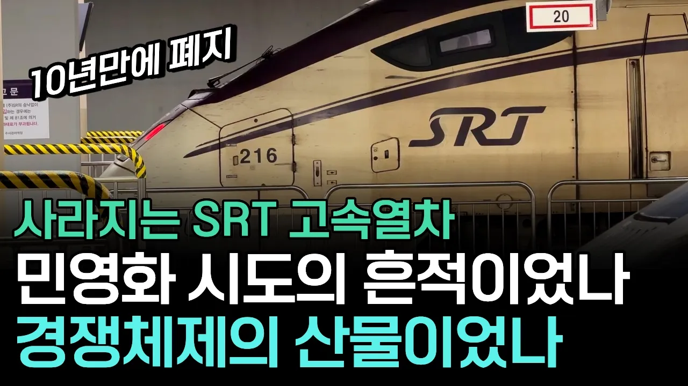

# 9월 SRT 폐지 - SRT는 왜 태어났고, 왜 없어지는가.

## 기본 정보
- **URL**: https://www.youtube.com/watch?v=2kKMF7c-TkE
- **채널명**: 역쟁이TV
- **구독자수**: 17만
- **조회수**: 416,676
- **업로드일**: 2026-08-16
- **영상 길이**: 15:15
- **댓글 수**: 1,600
- **좋아요 수**: 3,525

## 썸네일

---

## 댓글 (추천순 TOP 10)

| 순위 | 좋아요 | 댓글 |
|------|--------|------|
| 1 | 135 | 📌2026년 9월 1일부터 → SRT 열차는 모두 "KTX-산천"으로 운행, 수서/동탄/평택지제역 모두 KTX로 운행, 예매는 '코레일+‘에서 |
| 2 | 2 | 7:01 SRT 글자 자리에 "KTX 산천"이들어가게되는~~ |
| 3 | 1 | SRT는 와인산천 으로 되돌아가는~~ |
| 4 | 1 | 코레일+ 업데이트 한지 한달 다 되었고요. |
| 5 | 1,000 | 열차 > 짬때림 정비 > 짬때림 승무원 > 짬때림 개꿀노선 > 빼먹음 |
| 6 | 84 | S teal.ko R ail T rain |
| 7 | 5 | ​ @어허-l4v 그럴싸한데... |
| 8 | 42 | ??? : "정비·유지보수·안내 등 철도 서비스를 독점하는 코레일에 더 이상 의존하지 않겠다.", "현행 위탁 체계를 전면 재검토하고, 독자적인 차량 정비와 운영 역량을 갖춰 독립하겠다." - 2022.12.30. 당시 SR 대표이사 이XX -  현실 : 아무 것도 바뀐 거 없음 |
| 9 | 40 | 아직도 이거 기억난다 그때 KTX 대타로 투입해서 도와준거 보답으로 "우린 코레일과 다른 길을 가겠다" ㅋㅋㅋ |
| 10 | 63 | + 사고나니 코레일탓함 ㅋㅋㅋㅋ |
