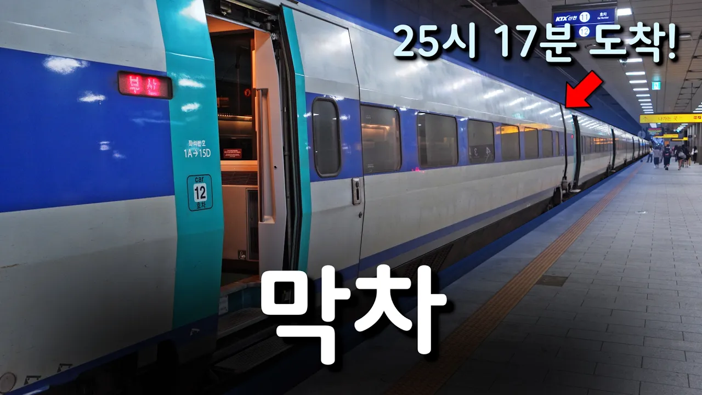

# SRT가 사라진 자리.. 새롭게 전국 막차가 된 KTX를 타보았다 (새벽 1시 17분 도착)

## 기본 정보
- **URL**: https://www.youtube.com/watch?v=IRLnWGpJB_s
- **채널명**: Hagoon 하군
- **구독자수**: 2만
- **조회수**: 97,477
- **업로드일**: 2026-09-07
- **영상 길이**: 11:26
- **댓글 수**: 75
- **좋아요 수**: 435

## 썸네일

---

## 댓글 (추천순 TOP 10)

| 순위 | 좋아요 | 댓글 |
|------|--------|------|
| 1 | 17 | 막차 시간 대의 열차들은 굳이 사업소까지 안 가고, 역에서 대기했다가 새벽이나 아침 시간 대에 바로 운행하는 편성이더라구요. |
| 2 | 9 | 토요일에 부산갔다 지금 수서역으로 가는중인데 토요일에 SRT도색 산천타고 갔는뎅 신기하네요 |
| 3 | 33 | 거기 비석은 그대로 있어요 |
| 4 | 4 | 잘 보고 가요 ☺️ |
| 5 | 6 | 저는 23시09분 천안아산역에서 출발하는 열차가 울산역 막차이더군요 원래는 71열차였는데 83열차로 바뀌었더군요. 확실히 증차된 느낌이 드네요. 막차시간은 여전히 갔지만 말이죠. 그런데 영상이 너무 감성적으로 잘 찍혀서 계속보게되네요. 잘 보았습니다. 하군님도 환절기 건강 조심하세요^^ ㅎㅎ |
| 6 | 0 | 여전히 갔지만이 아니라 같지만 입니다 |
| 7 | 0 | 이거 찍느라 진짜 고생 많으셨겠네요 |
| 8 | 1 | 수서발 ktx 실현되었네요 근데 20량도 들어가고 와 수서역에 대변혁이네요😲😲😲 |
| 9 | 5 | 안녕하세요 :) 혹시 9호선 4단계와 관련한 영상도 시간 나면 올려주실 수 있나요? |
| 10 | 2 | 4:53 ~ 5:15 서대구역을 경유하는 부산발 고속선 경유하는 366과 복합으로 연결한 진주발 390은 월~목에만 운행하고 , 구포를 경유하는 부산발 380은 금~일 에만 운행 하더군요 ㅎㅎ |
