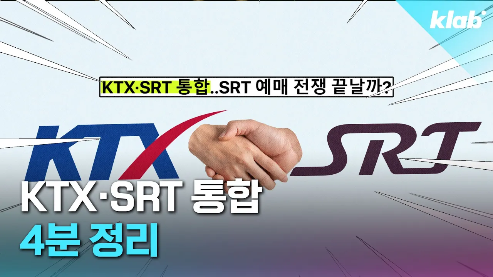

# KTX·SRT 통합하고 달라지는 점 4분 정리｜크랩

## 기본 정보
- **URL**: https://www.youtube.com/watch?v=lHVz4Vs9beE
- **채널명**: 크랩 KLAB
- **구독자수**: 106만
- **조회수**: 150,194
- **업로드일**: 2025-12-17
- **영상 길이**: 4:33
- **댓글 수**: 494
- **좋아요 수**: 1,781

## 썸네일

---

## 댓글 (추천순 TOP 10)

| 순위 | 좋아요 | 댓글 |
|------|--------|------|
| 1 | 362 | 세상에 어떤 회사가 경쟁사한테 차량, 정비, 운행, 청소및 시설관리를 전부 용역주냐 ㅋㅋㅋㅋㅋㅋㅋ |
| 2 | 15 | 모회사에게 용역 주는 이상한 구조죠. 보통 자회사에게 용역 주거나 다른 회사에게 용역 발주를 하는데 이상한 구조죠. |
| 3 | 3 | @성 @성단-p1k  항공사만 봐도 모회사에 기대는 경우가 수두룩한데?ㅋㅋ |
| 4 | 9 | ​ @aunjbkie ktx srt는... 애초에 자모 관계가 아니라 경쟁 목적으로 만든거잖아. 공동 운항까지 하는 항공사랑 같냐 |
| 5 | 4 |  @aunjbkie  경쟁 구도를 위해 설립이 되었는데 항공사랑 비교하는 건 말이 안 맞다고 생각이 안 드니? |
| 6 | 0 |  @aunjbkie  머리가 딸리면 그냥 가만히 있어라 |
| 7 | 0 | ​​ @aunjbkie 비유가 맞다고 보나 대한항공 진에어가 다른 지배구조인가? |
| 8 | 1 | 걍 고위공직자들 퇴직하고 낙하산 앉히려고 경쟁 운운하며 억지 논리로 만들어낸 회사 |
| 9 | 1,100 | srt가 코레일과의 경쟁이 아닌 '기생'하는 꼴로 되어서 통합이 확실히 좋을 듯 합니다. |
| 10 | 5 | 철도 알못 ㅋㅋㅋ |
