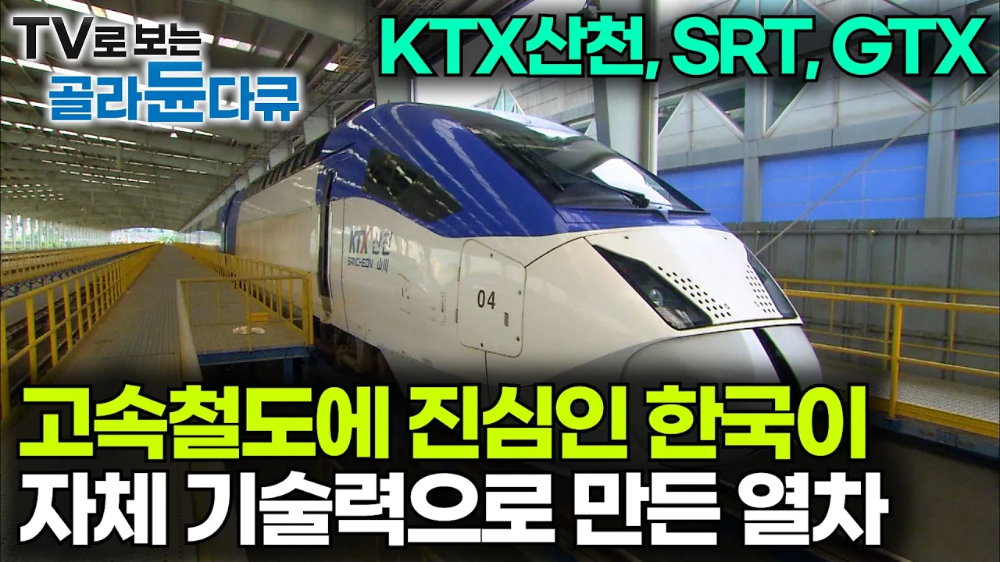

# 속도에 진심인 대한민국이 만들어낸 고속철도 KTX산천의 위엄｜메이드인 코리아 SRT, GTX｜다큐프라임｜#골라듄다큐

## 기본 정보
- **URL**: https://www.youtube.com/watch?v=xpSyhpb1eEM
- **채널명**: EBS Documentary
- **구독자수**: 545만
- **조회수**: 197,476
- **업로드일**: 2025-04-26
- **영상 길이**: 44:12
- **댓글 수**: 223
- **좋아요 수**: 1,556

## 썸네일

---

## 댓글 (추천순 TOP 10)

| 순위 | 좋아요 | 댓글 |
|------|--------|------|
| 1 | 172 | 그렇죠. 초반에 타국 고속철과는 비교도 되지 않는 엄청난 잔고장과 설계 미스들로 음의 방향으로 아주 높은 위엄을 보여줬죠. 그러나 어찌되었든, 산천이 있었기에 청룡까지 올 수 있었고 자국 기술로 고속철을 만들 수 있게 되었다는 것은 분명 고무적인 일입니다. |
| 2 | 47 | 알스톰에서 국내연구진들이 눈칫밥 먹으면서 배워온 것들임 하지만 더 핵심기술을 가르쳐 주지 않아서 스스로 개발해야하는 기술들도 많았음 그렇게 생겨난게 산천임 |
| 3 | 7 |  @hahman1st 팩트) 핵심기술이라도 가르쳐줘서 만들수라도 있던거고 기술진은 ㅈ도 하는게 없어서 역대급 잔고장 설계미스가 있던거다 |
| 4 | 1 | ​ @P-01_KR  당시 알스톰이 핵심기술 안 알려줘서 이래저래 부딫치느라고 만든게 HSR350X이고, 100호대 산천 초기운용 당시 시운전 기간 부족으로 에러가 너무 많았던 것도 존재합니다.   참고로 알스톰은 평시관리와 경검수 정도만 알려주고 중검수와 핵심기술은 안 알려줄려고 했습니다. 이 때문에 차량 관리 및 중검수는 프랑스 국철 SNCF의 직원들을 통해서 배워왔습니다. |
| 5 | 2 | 산천은 새차일때는 좋은데 노후화가 진행될수록 고속구간 내장재 떨림과 승차감이 확 떨어짐 반면 알스톰제는 이제 내구연한이 다되가는 퇴물인데도 승차감과 소음도 적음 |
| 6 | 1 | 속도가 시속 250km에 불과하다는 게 사실인가요? 인도네시아의 고속열차 '우시(WHOOSH)'는 사실 한국의 KTX보다 훨씬 빠릅니다. 당신들은 한참 뒤처져 있군요.🤔 |
| 7 | 1 |  @kurniajaya1989  I'm from India! Applause to Whoosh for operating CRRC's wonderful high-speed train! Love Indonesia♥♥ Love China♥♥ 🇨🇳🇮🇩🚄🚆 |
| 8 | 1 |  @kurniajaya1989  최고시속 320km인데 뭔 개솔 그리고 니네나라 국민들은 고속철도 탈 돈은 있고? |
| 9 | 1 |  @Enki22_00  정말이에요? 고작 320km라고요? ㅋㅋ |
| 10 | 1 |  @kurniajaya1989  근데 그거 니네기술 아니잖아 우리는 우리가 독자로 만든건데 그리고 차세대 KTX 청룡(EMU-350)은 350키로란다 |
