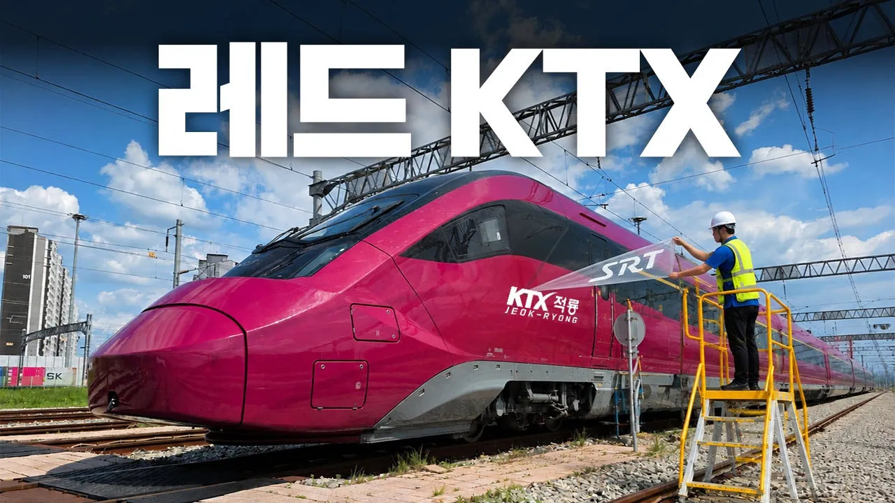

# SRT에서 '레드 KTX'로 탈바꿈한 새로운 고속열차 공개!

## 기본 정보
- **URL**: https://www.youtube.com/watch?v=bt-U7Xka_xk
- **채널명**: KORAIL :: Korea Railroad
- **구독자수**: 14만
- **조회수**: 398,730
- **업로드일**: 2026-09-12
- **영상 길이**: 7:13
- **댓글 수**: 792
- **좋아요 수**: 3,170

## 썸네일

---

## 댓글 (추천순 TOP 10)

| 순위 | 좋아요 | 댓글 |
|------|--------|------|
| 1 | 51 | 영상 내에 '레드 KTX'로 등장하는 신형 고속열차는 편의상 'KTX-적룡'으로 표현했으나, 정식운행 전이므로 명칭, 도색 변경 여부 등은 아직 확정되지 않은점 참고바랍니다. |
| 2 | 4 | 그냥 확정해주세요 적룡으로 🥺 |
| 3 | 1 | 청룡을 메인으로 적룡(가칭)도 유지해서, 특정 노선 전용이 아닌 시간대 별로 랜덤으로 청룡과 적룡이 배치 되는 것도 괜찮을거 같고, 아님 더 세련된 새 도색 시도도 좋음  31 아이스크림 처럼, 다양성 보는 재미도 고려해 주면 좋겠다는 |
| 4 | 1 | 적룡 보다 도깨비 이무기 해태 구미호 좋을거같은데 청룡은 동아시아 상상동물 적룡은 .. 조금 아쉽네요 |
| 5 | 0 | 주작은 안할거같은데 걍 적룡 쓸듯ㅋㅋ |
| 6 | 0 | 아 모르겠고 적룡 축하함 ㅎㅎㅎㅎㅎㅎㅎㅎㅎㅎㅎㅎㅎㅎㅎㅎㅎㅎㅎㅎㅎㅎㅎㅎㅎㅎㅎㅎㅎ 적룡으로 안하면 코레일에 민원넣을거임!❤ |
| 7 | 892 | KTX 주작도 나쁘지 않을 듯 |
| 8 | 106 | 주작이여! |
| 9 | 79 | 날아오르라 |
| 10 | 135 | 청룡 주작 백호 현무 이런 시리즈로..!?🤔... |
