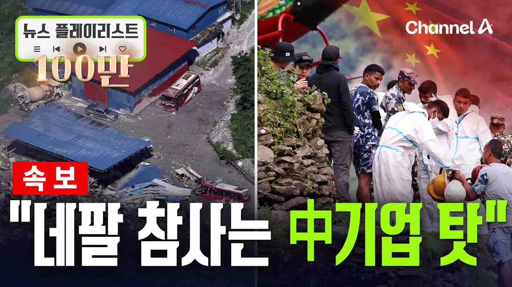

# "네팔 대홍수는 국경 인근 중국 국영기업 발전소 건설 때문"… 아르헨 관리 주장에 '발칵' [뉴스플레이리스트] / 채널A

## 기본 정보
- **URL**: https://www.youtube.com/watch?v=7EqnA9GkaJM
- **채널명**: Channel A News (Korea)
- **구독자수**: 350만
- **조회수**: 1,174,037
- **업로드일**: 2026-09-02
- **영상 길이**: 16:45
- **댓글 수**: 981
- **좋아요 수**: 4,854

## 썸네일

---

## 댓글 (추천순 TOP 10)

| 순위 | 좋아요 | 댓글 |
|------|--------|------|
| 1 | 1,300 | 역시 중국과 엮이면 끝은 항상 파국이다. 개인이든, 단체든, 국가든 |
| 2 | 75 | 리짜이밍의 한국 ㅋㅋㅋ |
| 3 | 62 | ​ @kby2562 빨리 끌어 내려야합니다 |
| 4 | 0 | ​ @kby2562 뜬금없이 ㅋㅋ어리버리 손바닥왕자 윤무능보다는 백배낫다 |
| 5 | 5 |  @wooahh890  우동사리인가? 윤무능이 낫지 사리판단제대로좀 해라 |
| 6 | 1 | ​ @튜브유-k7k  무능만 했음 끌어 내렸을까요? 나라를 통체 삶아 먹으려 해서 끌어 내림. |
| 7 | 2 |  @조나단-w4f  지금 이재명 대통령은 이미 삶아 먹고 있는데요? |
| 8 | 0 | ​ @minkingfilm  친위 쿠테타를 이해를 못하시는군요. |
| 9 | 0 |  @조나단-w4f  뭔소리에요? |
| 10 | 0 | ​ @wooahh890 아직도 정신을못차렸네 이래서 저지능은 투표권박탈을해야 나라가산다 |
