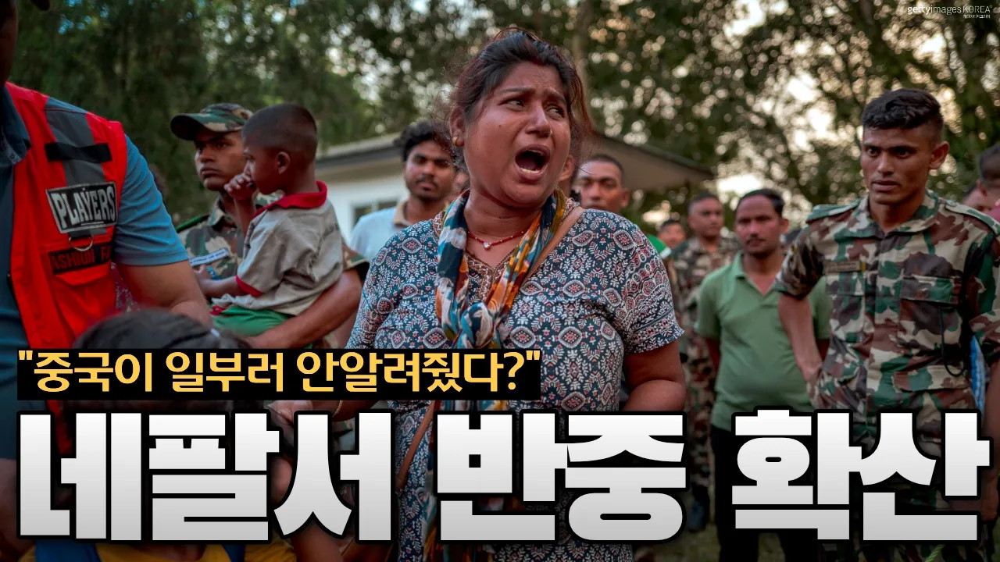

# “왜 미리 알려주지 않았나?” 네팔 대홍수에 네팔 반중 여론 확산

## 기본 정보
- **URL**: https://www.youtube.com/watch?v=BB_zZ4yAjrE
- **채널명**: 센서스튜디오
- **구독자수**: 65만
- **조회수**: 344,693
- **업로드일**: 2026-08-31
- **영상 길이**: 8:19
- **댓글 수**: 764
- **좋아요 수**: 5,018

## 썸네일

---

## 댓글 (추천순 TOP 10)

| 순위 | 좋아요 | 댓글 |
|------|--------|------|
| 1 | 738 | 상황이 참 이상하게 흘러가네용 네팔 여론은 중국 때문이다라며 반중 여론이 커지고 중국은 12일전부터 정보를 제공해주었다고 하고 |
| 2 | 188 | 유튜브도 댓글에 국적표시해야하는데 |
| 3 | 309 | 보통 그러면 중국이 구라쳤을확률 99퍼 |
| 4 | 2 | ​ @h._.nnnnnd 올키 |
| 5 | 133 | 중국을 어떻게 믿나? 언론여론국민입틀막 조작은폐 숫자놀이 |
| 6 | 100 | 뭐 착장죽장은 과학이죠 |
| 7 | 22 | 중국때문이잖음.. |
| 8 | 19 | 정부가 시민들 통제하려고 안 풀었다? |
| 9 | 18 | 중국은 세계자유언론지수 180개국중 178위 나라에요. 중국이 하는 말은 절대 믿을수 없음 |
| 10 | 7 |  @sosj9420  밑에 두나라가 있다는게 더 놀랍네요 |
