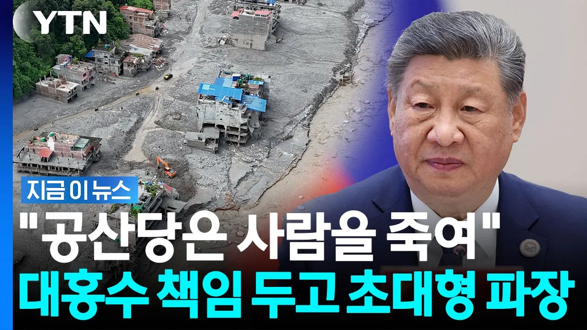

# "네팔 대홍수, 중국 공산당 때문"…대형 파장 부른 발언 [지금이뉴스] / YTN

## 기본 정보
- **URL**: https://www.youtube.com/watch?v=vZEZjcvOb1s
- **채널명**:  YTN
- **구독자수**: 540만
- **조회수**: 175,593
- **업로드일**: 2026-09-03
- **영상 길이**: 2:11
- **댓글 수**: 351
- **좋아요 수**: 1,123

## 썸네일

---

## 댓글 (추천순 TOP 10)

| 순위 | 좋아요 | 댓글 |
|------|--------|------|
| 1 | 285 | 현장 공개 못하는게 수상한 거지 |
| 2 | 593 | 중국은 항상 떳떳하지 못해서 숨기는걸 좋아하지. |
| 3 | 16 | 518 유공자. 병적기록도 똑같네요 |
| 4 | 0 | 韩国总是喜欢隐瞒事情，因为他们没有什么可以隐瞒发 |
| 5 | 0 |  @向湖北 숨길게 없는데 뭘 숨기려해요…? 그냥 문장 자체가 이상해서 물어봅니다 |
| 6 | 12 | 근거 없는 혐중 하지 말라는 찢명이형 말씀 못들었냐?😂 |
| 7 | 3 |  @Giantsquid626 ㅋㅋㅋㅋ 난 그런 형 없다 |
| 8 | 2 |  @Giantsquid626  읷걹햁섣 갋능핣셃욟? |
| 9 | 461 | 중공이 이렇게 발작을 하는 걸 보니 이번 사고에 뭔가 있구나 |
| 10 | 16 | 한국이 댐건설 완료했으면 네팔 전기공급, 재해에 안정성을 보장할수 있었는데, 딱 완료되기 이전에 다이나마이트?  폭파..얼음산 흔들려서 한국인 및 땜도 파괴되고..한국의 제정적 손실이 이만저만 아님...모두 한국 국민의 세금인데.. |
