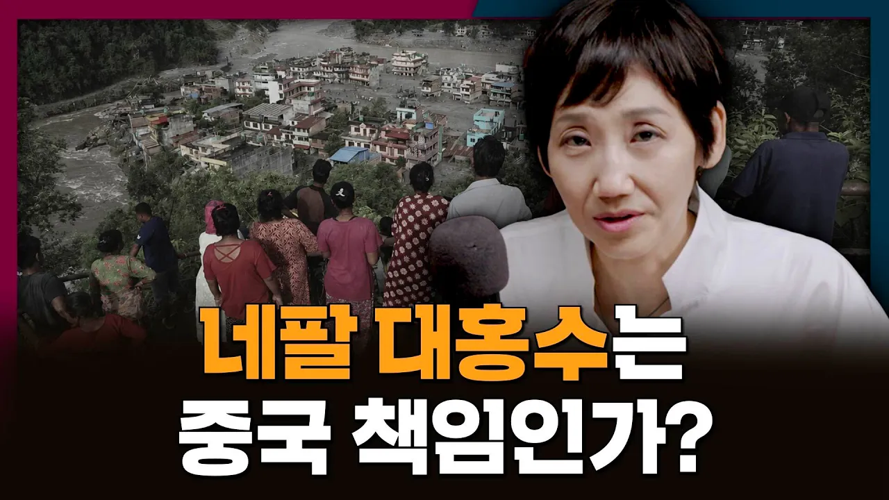

# 네팔 대홍수의 원인을 둘러싼 갈등! 과연 중국 때문일까?

## 기본 정보
- **URL**: https://www.youtube.com/watch?v=dTTiz4e7U7M
- **채널명**: 김지윤의 지식Play
- **구독자수**: 138만
- **조회수**: 114,019
- **업로드일**: 2026-09-09
- **영상 길이**: 11:19
- **댓글 수**: 237
- **좋아요 수**: 2,196

## 썸네일

---

## 댓글 (추천순 TOP 10)

| 순위 | 좋아요 | 댓글 |
|------|--------|------|
| 1 | 75 | 강은 국경을 모르기 때문이죠 희생되신 분들의 명복을..ㅠㅠ |
| 2 | 208 | 중국을 욕한 게 아니라 욕하고 보니 중국 |
| 3 | 11 | 중국이 도움되는 게 있습니까? |
| 4 | 1 | 솔직히 내가 보기엔 중국이라 욕하는 거 맞음 |
| 5 | 3 | 근본적 원인은 미국 ㅇㅈㄹ은 더 큰 ㄱ소리긴 한데 요즘 한국 사람들 너무 무지성으로 중국 욕하고 싫어하긴 함, 최근에 대체 무슨 일이 있었는데? 물론 싫어할 만한 이유는 당연히 많음, 무개념 중국인이나 범죄나 한한령이나 역사 왜곡이나.. 근데 중요한 건 이런 건 늘 있었음. 왜 갑자기 이제 와서 발작하냐는 거지. 너무 무지성이라 진지하게 미국이 한중관계 발전을 우려하여 물밑에서 혐오를 조장 중일 가능성이 ㅈㄴ 높아 보임. 미국이란 나라 전혀 싫어하지 않고 꼭 필요란 동맹이지만 미국 특성상 그런 짓 충분히 하고도 남음 |
| 6 | 1 |  @blue-d4g  중국은 대놓고 하고 미국은 숨어서 한다 |
| 7 | 0 | ​ @blue-d4g 비호감이 쌓이고 쌓인거지 꼭 최근에 뭔가 계기가 있어야 그 때만 딱 싫어하나 |
| 8 | 10 | ​ @blue-d4g 과거부터 해왔던 일인데 왜 이제와서 목소리 높히냐는 소리는 진짜 무지랭이 같네 |
| 9 | 4 | ​ @blue-d4g  저도 어딘가 글을 써봤더니 무지성으로 욕먹더라구요. 조금만 옳은 소리 하면 바로 허난성 광저우랑, 호남 광주 댓글러들이 한 목소리로 욕하는 듯. 한국인이 아니라 중국인들이 댓글 다는거 같아요 |
| 10 | 4 | 맨날 중국욕하고 다니면 살림살이 나아지더냐 😂😂😂  근본적 원인은 미국때문인데 |
