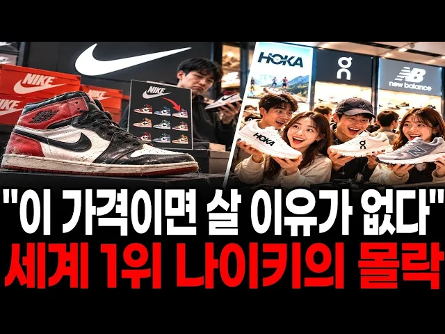

# 잘나가던 나이키의 몰락, 소비자가 등 돌린 진짜 이유

## 기본 정보
- **URL**: https://www.youtube.com/watch?v=oyURnFXUy9Q
- **채널명**: 지식발굴단
- **구독자수**: 3만
- **조회수**: 15,035
- **업로드일**: 2026-09-09
- **영상 길이**: 26:24
- **댓글 수**: 7
- **좋아요 수**: 64

## 썸네일

---

## 댓글 (추천순 TOP 10)

| 순위 | 좋아요 | 댓글 |
|------|--------|------|
| 1 | 13 | 망한 이유 어느 순간 품질이 안 좋아졌다  그리고 점점 비싸졌다 |
| 2 | 0 | 슬슬 모아가야겠구만 |
| 3 | 3 | 나는 나이키를 혐오한다. 색깔이 너무 요란해서 나이키 신고 밖에 나가면 사람은 안 보이고 지나치게 튀는 나이키 만 보인다. |
| 4 | 2 | 나이키 = 마이클 조단 (농구황제)  🏀 90년대 NBA 농구  스케쳐스 = 이재용 (삼성회장)  대한민국 대표 재벌가  나이키는 엠버서더 마케팅의  실패로 나이키 하면 떠오르는  좋던 이미지가 사라졌어요. |
| 5 | 3 | 1년 지났는데 밑창 떨어지고 엄지발가락  윗쪽 구멍남  ㅋㅋㅋㅋ 요즘  신발이 떨어져서 버려보긴 처음!! 다신 나이키 모든제품 안사기로 함 |
| 6 | 0 | 나이키 아디다스 프로스펙스 아식스 전부다 6개월이상 못버팀 그런데 뉴발란스는 아직도 멀쩡하네요 저한테는 뉴발이 최고임 |
| 7 | 2 | 이 영상을 보시는 분들은 지급서부터 분할로 나이키 주식을 매입하세요.ㅋㅋㅋㅋㅋㅋㅋㅋㅋㅋㅋㅋ |
