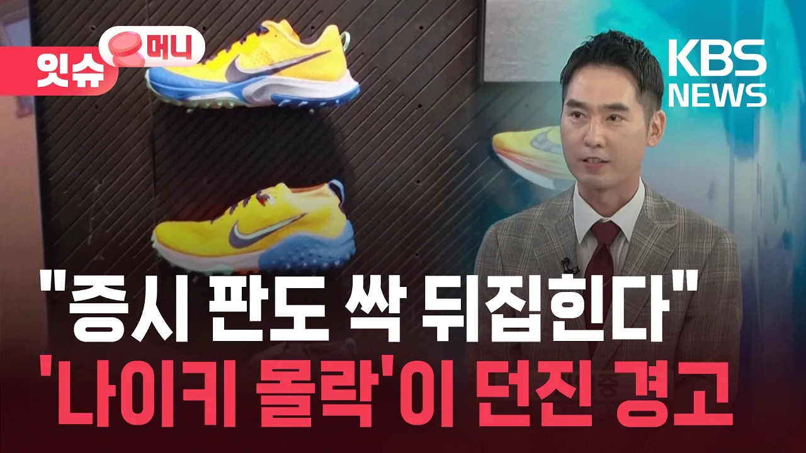

# “나이키, S&P100서 퇴출”…운동화를 못 만들어서가 아니라고요? [잇슈 머니] / KBS 2026.09.09.

## 기본 정보
- **URL**: https://www.youtube.com/watch?v=YAbWP7APSPk
- **채널명**: KBS News
- **구독자수**: 370만
- **조회수**: 9,161
- **업로드일**: 2026-09-09
- **영상 길이**: 4:31
- **댓글 수**: 11
- **좋아요 수**: 26

## 썸네일

---

## 댓글 (추천순 TOP 10)

| 순위 | 좋아요 | 댓글 |
|------|--------|------|
| 1 | 1 | 저렴해진 품질 그렇지 않는 가격  수 없이 많은 대체재 |
| 2 | 2 | 품질부터 안좋음. 못 만들고 혁신도 없음 |
| 3 | 0 | Last do it 슬로건 바꾸자 ㅜ |
| 4 | 0 | 요즘 누가 나이키 신노~ |
| 5 | 0 | 삐삐, 개인 컴퓨터, 통신용 휴대폰, 인터넷, 스마트폰, 클라우드 등의 대략적인 순서로 정보화 사회가 발전,  이런 변화에서 반도체 수요는 한계가 있음. 그러나 다음 순서의 인공지능 시대에는 메모리 반도체 수요의  한계가 어디까지인지 누구도 모름...  그 주역은 미국, 대만, 한국 |
| 6 | 0 | 나이키 라이벌은 닌텐도라고 했던 시절도있었는데 다 옛말이 되버렸네 |
| 7 | 0 | 나이키는 혼 좀 나야해 |
| 8 | 0 | 조던으로 밧줄 잘 잡더니.. 사라진다고라? ㅋㅋㅋㅋㅋㅋㅋㅋ |
| 9 | 0 | 나이키ceo가 다 말아먹음 |
| 10 | 0 | 나이키가 한국사람 발에 잘 안맞는것도 문제입니다. 한국사람 발볼이 넓은편인데 나이키는 좁음 |
