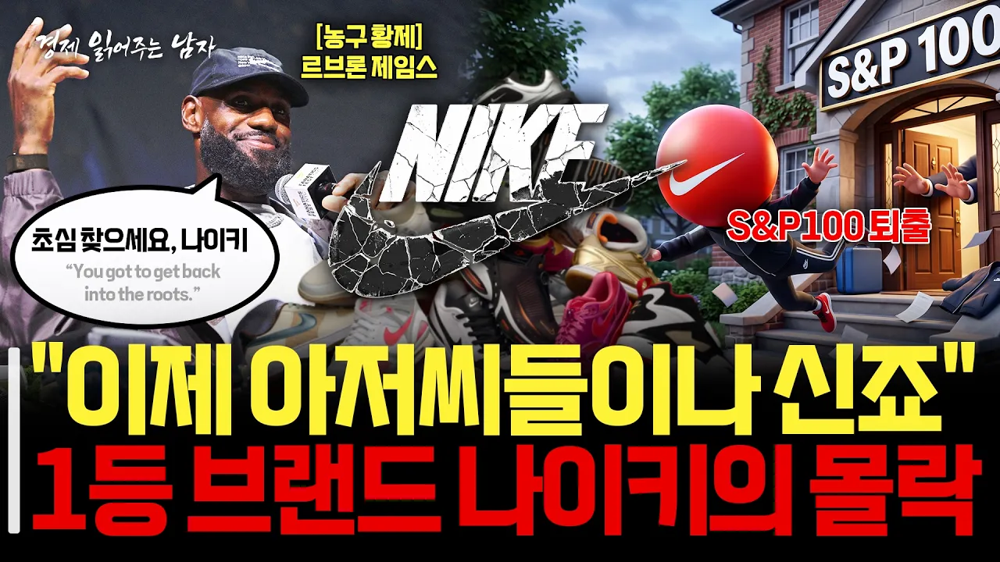

# 1등의 오만이 부른 몰락...나이키가 S&P100에서 퇴출된 진짜 이유 [경제 읽어주는 남자]

## 기본 정보
- **URL**: https://www.youtube.com/watch?v=E9cGgMcZdbs
- **채널명**: 한국증권TV
- **구독자수**: 20만
- **조회수**: 13,924
- **업로드일**: 2026-09-08
- **영상 길이**: 8:54
- **댓글 수**: 7
- **좋아요 수**: 19

## 썸네일

---

## 댓글 (추천순 TOP 10)

| 순위 | 좋아요 | 댓글 |
|------|--------|------|
| 1 | 3 | 퇴출이 아니라 제외 입니다 ㅋㅋㅋㅋ |
| 2 | 1 | 그러긴해 우리 시대의 로망일 뿐이지. |
| 3 | 0 | 도나호는 인생 업적 남겼네 ㅋㅋ |
| 4 | 0 | 과연 반등에 성공할 수 있을지....그래도 어렸을 떄 선망했던(?) 브랜드였기에....속으로 재기를 응원하게 되네요.  영상 잘보았습니다. |
| 5 | 1 | 솔직히 신어보면 타브렌드 가격대 수준의 나이키 제품은 기능성 제로에 기능성 제품은 너무 비쌈
 심지어 상표 가치까지 비슷한 수준까지 따라온 대체제품들이 너무 많음
 그래도 브랜드 파워가 아직 막강해서 다시 탈환할꺼라고 봄 |
| 6 | 0 | 나이키 위기타령 그만해라. 몇년째 이소릴 듣는지 |
