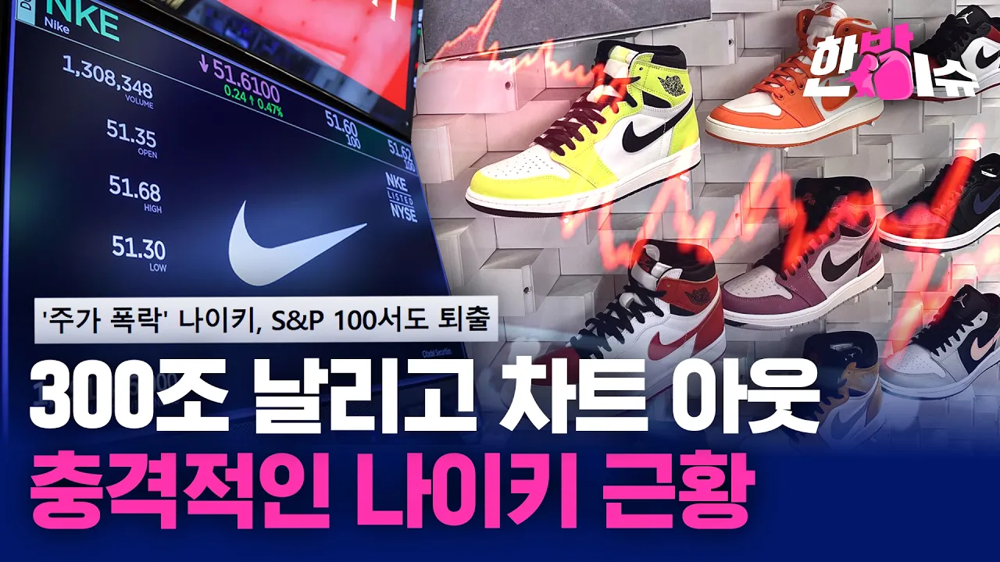

# 나이키, 진짜 망했나요?...S&P 100 퇴출의 의미 [한방이슈] / YTN

## 기본 정보
- **URL**: https://www.youtube.com/watch?v=4xpMN3FxqXM
- **채널명**:  YTN
- **구독자수**: 541만
- **조회수**: 213,004
- **업로드일**: 2026-09-09
- **영상 길이**: 3:50
- **댓글 수**: 259
- **좋아요 수**: 291

## 썸네일

---

## 댓글 (추천순 TOP 10)

| 순위 | 좋아요 | 댓글 |
|------|--------|------|
| 1 | 70 | 품질이 진짜..너무해요 |
| 2 | 25 | 이상한 광고할때부터 알아봤다... |
| 3 | 46 | 한정판  맛보면서   서서히  망해감 |
| 4 | 18 | 나이키신발 투자 구매해서 보관중인 사람들 …. 망했네 |
| 5 | 31 | 기능성 없고, 퀄리티가 폭망이였음 가격에 비해..디자인 돌려막기 까지.. |
| 6 | 5 | PC에 과도하게 집착할때부터 알아봤다. |
| 7 | 77 | 브랜드 장사하다 폭망함  언제적 나이키냐 |
| 8 | 5 | ㅇㄱㄹㅇ 마케팅과 브랜드 장사에만 매몰 됨. 품질이 우수해야 하는데.... 품질도 별로고 디자인마저 구려짐 |
| 9 | 1 | ​ @롸잇나우-e6h  디자인은 구려졌다기보단 변화가 없음 20년전이랑 달라진게 색상이 늘어난게 전부 ㅋㅋ |
| 10 | 19 | 나이키 유통값이 너무 비싸요 착화감은 5만원짜리 노브랜드 운동화인데 15만원을 받아먹으니 |
