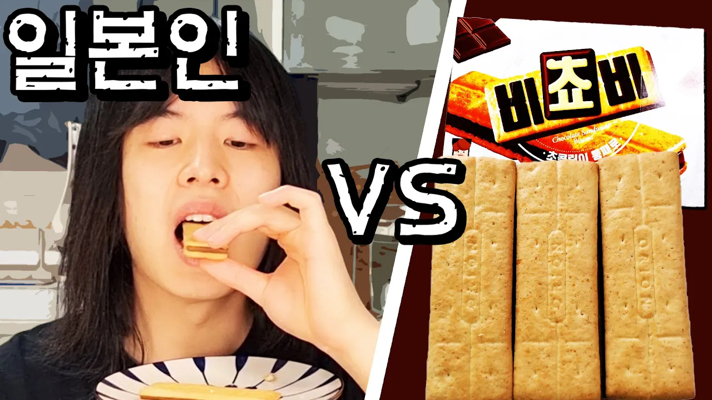

# 한국 비쵸비 과자를 처음 먹어본 일본인의 반응!?

## 기본 정보
- **URL**: https://www.youtube.com/watch?v=0DKoQrHrvr8
- **채널명**: HIKIMAN
- **구독자수**: 3,890
- **조회수**: 6,068
- **업로드일**: 2023-10-09
- **영상 길이**: 1:27
- **댓글 수**: 15
- **좋아요 수**: 47

## 썸네일

---

## 댓글 (추천순 TOP 10)

| 순위 | 좋아요 | 댓글 |
|------|--------|------|
| 1 | 5 | 아 컨셉이구나 어쩐지... |
| 2 | 0 | 저것 아는동생한테주고 한번도 안먹어봤어요 응원해드려요 |
| 3 | 1 | 뉴스보고왔어요ㅋㅋㅋㅋ 비쵸비먹는 일본인으로 나오던데 |
| 4 | 0 | 얼려먹어도 맛있어요 😊😊😊 |
| 5 | 0 | 초코 좋아하시면 가나 랑드샤(쇼콜라/쿠엔크), 오리온 꼬북칩(초코츄러스맛) 도 맛있어요. 짠거 괜찮으시면 무뚝뚝감자칩도 맛있는데 많이 짜서 호불호 있는 편 |
| 6 | 0 | 프응 닮으셨네요 ㅋㅋ |
| 7 | 0 | 비스킷 초코 비스킷이라 비쵸비겠지? |
| 8 | 0 | 88848원임? |
| 9 | 1 | 빅파이 드셔보세요. 좋아하실 거에요. |
| 10 | 0 | 메모해둘게요! |
