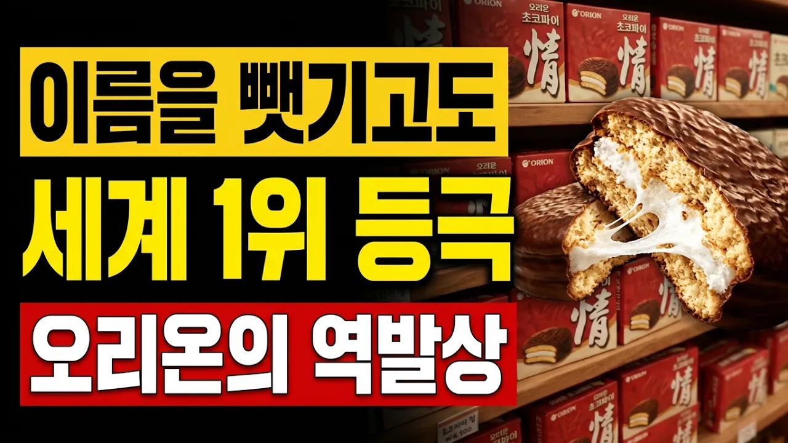

# 이름을 빼앗기고도 세계 1위를 삼킨 오리온의 역발상

## 기본 정보
- **URL**: https://www.youtube.com/watch?v=LKA92Xz1vEg
- **채널명**: 선택의순간
- **구독자수**: 331
- **조회수**: 3,226
- **업로드일**: 2026-09-04
- **영상 길이**: 6:27
- **댓글 수**: 8
- **좋아요 수**: 13

## 썸네일

---

## 댓글 (추천순 TOP 10)

| 순위 | 좋아요 | 댓글 |
|------|--------|------|
| 1 | 3 | '초코파이' 이름을 빼앗기고도 세계 1위를 차지한 오리온의 숨은 이야기  1. 법원에서 빼앗긴 이름과 '정(情)'의 역발상 1974년 오리온(당시 동양제과)이 2년간의 연구 끝에 개발한 초코파이가 대히트를 치자 수많은 미투 제품이 쏟아졌습니다. 이에 상표권 소송을 제기했으나, 1999년 대법원은 '초코파이는 빵 사이에 마시멜로를 넣고 초콜릿을 바른 과자를 뜻하는 보통명사'라며 특정 기업이 독점할 수 없다고 판결했습니다. 이름을 잃어버릴 위기 속에서 오리온은 1989년부터 패키지에 붓글씨로 '정(情)'을 새기고 감성 마케팅을 펼쳐, "초코파이는 누구나 만들어도 진짜 정이 담긴 원조는 오리온"이라는 인식을 대중의 마음에 확고히 각인시켰습니다.  2. 자전거 행상과 매대 청소로 뚫어낸 중국 대륙 1990년대 초 중국 진출 당시 낯선 한국 과자라며 문전박대를 당하자, 영업사원들은 양복 대신 작업복을 입고 자전거에 과자 상자를 실어 골목길 구멍가게들을 일일이 찾아갔습니다. "외상으로 둘 테니 팔리면 돈을 달라"며 먼지 쌓인 매대를 직접 걸레로 닦아주는 성실함으로 상인들의 마음을 열었습니다. 이후 중국인이 중시하는 유교 가치인 '어질 인(仁)' 자를 상자에 새기고 좋은 친구라는 뜻의 '하오리여우(好麗友)' 브랜드로 안착하며 대륙 파이 시장 1위를 달성했습니다.  3. 베트남 제사상부터 러시아 국민 차(茶) 간식까지 오리온 초코파이는 단순한 수입 과자를 넘어 각국의 문화 속으로 깊숙이 파고들었습니다. 베트남에서는 조상에게 바치는 가장 귀한 제사상에 오르는 문화적 상징이 되었고, 혹한의 러시아에서는 따뜻한 홍차와 곁들여 먹는 국민 간식으로 자리잡아 현지 공장까지 대거 증설했습니다. 그 결과 오리온은 전체 매출의 60% 이상을 해외에서 벌어들이며 누적 판매량 460억 개라는 대기록을 썼습니다.  이름이라는 껍데기보다 '소비자의 마음'을 얻는 길을 택했던 오리온의 역발상, 여러분은 오리온 초코파이와 관련해 어떤 추억을 가지고 계시나요? 자유롭게 생각을 댓글로 나눠주세요! |
| 2 | 1 | 이미 우리의 마음속엔 "정"이란 이름으로 자리 매김 했습니다. |
| 3 | 1 | 90년대 군대 푸세식 변소에서 몰래 먹었다던 그 초콩퐈이란 말인과~ |
| 4 | 2 | 빼앗긴게 아닙니다. 다들 그렇게 생각하는데... 법원에서는 이름 자체에 대해서 판결을 내린게 아닙니다.  오리온은 빵 사이에 마쉬멜로우를 넣고 초콜릿으로 코팅한 제품의 명칭을 "초코파이"라고 했기 때문에, 그걸 '초코', '파이'의 명사들의 조합... 즉, 레시피를 기반으로 만든 제품을 명사로 인정 할 수 없다는 의미에서 판단을 내린겁니다. 오리온이 판단을 잘못한거에요. 차라리 해당 레시피를 가지고, 다른 이름을 사용했으면, 충분히 상표권으로 인정 받을 수 있었다는게 변리사들 의견이었다고 하죠~!! 그리고, 우리나라에서의 상표권은 같은 계열의 상표권이면, 레시피가 달라도, "초코 파이"라는 이름을 쓸 수 없기 때문에, 공정 거래를 위해서 오리온의 손을 들어주지 못한겁니다.  또, 저 초코파이가 실제 파이가 아니라는 점도 한몫하죠~~ 특히 유럽사람들이 초코파이라는 말을 들었을때 생각했던 이미지는 저 모양이 아니었던거죠~!!  그러다보니, 실제로 초콜릿으로 파이의 형태로 만들어도 "초코 파이"라는 말을 쓸수가 없는겁니다.  그리고, 더 큰 문제는 뭐냐?? 다른 이름으로 상표권을 인정 받을라고 했어도... 오리온이 너무 늦게... 이미 경쟁사에서 엄청난 물량을 판매 했을때도, 상표권으로 등록을 안했다는거죠~!! 점유율이 타사가 더 많아 지니까, 그제서야 상표권을 낸거라 단순 이름 때문이라고 해도 법원에서는 상표권을 주지 않았을거라는겁니다.  오리온의 안일한 생각 때문에, 사용을 못하게 된거지, 뺏긴게 아니에요~!!  팩트체크는 제대로 하셔야겠습니다. |
| 5 | 2 | 댓글 작성자님 말씀대로 법리적으로는 '초코'와 '파이'의 결합이라는 기술적 표장 문제, 그리고 초기 상표 관리 미흡으로 인한 '관용표장(보통명사)화'가 대법원 패소의 핵심 법리가 맞습니다. 당시 판결의 법적 배경을 매우 정확하고 깊이 있게 짚어주셨네요! 👍
 
 영상에서 '빼앗겼다'고 표현한 것은 엄밀한 법률적 처분을 뜻하기보다는, 1974년 아무도 가보지 않은 시장을 개척하고 레시피와 이름을 정립했던 '창업/개발 기업의 관점'을 비즈니스 서사로 다루었기 때문입니다. 지식재산권 개념이 희박하던 70년대에 후발 대기업들의 미투 공세로 어렵게 일군 브랜드 가치가 시장에 희석되어버린 뼈아픈 역사를 드라마틱하게 전달하고자 했습니다.
 
 덕분에 법률적 사실관계까지 댓글을 통해 풍성하게 채워져 다른 시청자분들께도 큰 공부가 될 것 같습니다. 깊이 있는 지적과 고견 감사드립니다! |
| 6 | 1 | 맛 자체가 다른데 뭐. 이건 라면하곤 또 다름. 라면이야 향이나 기타 보조재료로 똑 라면은 여러가지 맛이 있을수 있어서 차별점을 둘순 있지만, 초코파이는 애시당초 오리온이랑 다른거랑  맛자체가 질적으로 바로 차이가 나.  그러니 그냥 독보적 지위를 누리는거지. |
| 7 | 1 | 근데 롯데 크라운보다 오리온이 더 맛있음 |
| 8 | 0 | 저는 오리온이 좀 덜달고 쫀쫀해서 맛있더라고요..ㅋㅋ |
