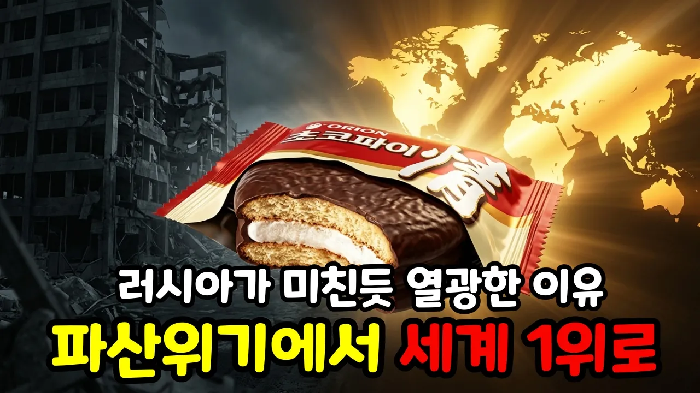

# 누적 510억 개, 왜 초코파이만 세계를 정복했나? 오리온 50년 생존 원칙 4가지.

## 기본 정보
- **URL**: https://www.youtube.com/watch?v=pARP0cwWHbk
- **채널명**: 경제 이즈 머니
- **구독자수**: 24
- **조회수**: 554
- **업로드일**: 2026-03-15
- **영상 길이**: 11:56
- **댓글 수**: 4
- **좋아요 수**: 7

## 썸네일

---

## 댓글 (추천순 TOP 10)

| 순위 | 좋아요 | 댓글 |
|------|--------|------|
| 1 | 0 | ai 로 영상을 만들면 자기도 이 내용이 무슨 내용인지 모르게 된다. |
| 2 | 1 | 맞습니다! 단순히 AI가 뱉어낸 내용을 그대로 옮긴다면 시청자분들께 아무런 도움을 드릴 수 없겠죠. 그래서 저는 AI를 영상 제작의 효율을 높이는 도구로만 쓰고, 대본의 논리와 팩트 체크는 제가 끝까지 책임지고 직접 챙기고 있습니다.  부족함 없는 경제 교육 콘텐츠를 보여드릴 수 있도록 더 치열하게 고민하겠습니다. 소중한 의견 감사합니다! |
| 3 | 0 |  @경제이즈머니  흥미롭고 유용한 영상이었어요. 구독하고 앞으로도 자주 찾아 뵐께요. 채널 번창하시기 바랍니다 |
| 4 | 0 | 반갑습니다, @e야옹e님! 영상이 유익하셨다니 제작자로서 정말 큰 보람을 느낍니다. 구독과 응원 말씀에 힘이 나네요! 앞으로도 실질적으로 도움이 되는 양질의 경제 콘텐츠로 자주 찾아뵙겠습니다. 감사합니다! |
