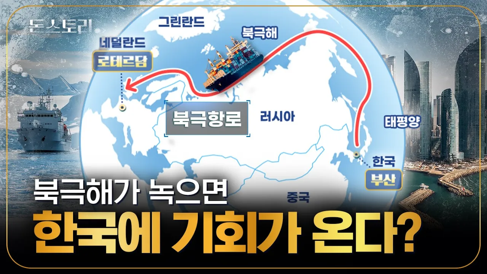

# '북극항로 기회일까? 허상일까?' 전 세계가 주목하는 북극항로 주인공, 한국이 될 수 있을까?｜돈스토리

## 기본 정보
- **URL**: https://www.youtube.com/watch?v=9YfIbrTghl8
- **채널명**: BNK금융그룹
- **구독자수**: 26만
- **조회수**: 204,004
- **업로드일**: 2025-08-21
- **영상 길이**: 11:43
- **댓글 수**: 293
- **좋아요 수**: 1,411

## 썸네일

---

## 댓글 (추천순 TOP 10)

| 순위 | 좋아요 | 댓글 |
|------|--------|------|
| 1 | 15 | 길게봐야지..우리도 준비해야된다. |
| 2 | 18 | 북극길이 열린다는 건 한국은 이제 여름에는 더 더럽게 덥고 겨울은 더 더럽게 춥게 됨. |
| 3 | 11 | 우리나라의 쇄빙선이 더 필요함. |
| 4 | 5 | 허상 아닙니다 차근차근 하 준비 하고 나가면 우리 나라 몫을 찾습니다 |
| 5 | 26 | 온난화로 얼음 녹는다고 슬퍼하더니 녹으면 북극항로 생길 수 있으니 좋다하고 ㅋㅋㅋㅋㅋㅋㅋㅋㅋㅋㅋ |
| 6 | 1 | 이제 지구온난화 따위는 문제가 아닐듯 ai발전 속도가 훨씬 더 빠름 |
| 7 | 1 | 트럼프가 온난화는 세기의 사기극이라 했습니다. |
| 8 | 12 | 배가 다닐수 있게 빙하가 적당히 녹아시 갈라진다는  얘기겠지 |
| 9 | 105 | 물류거점에다가 추가로 되도않는 중국바라보고 인천쪽에 금융허브만들지말고 싱가폴처럼 부산에 금융허브만들어야함. 특히 가상화폐 자유구역만들어야됨. 홍콩 일본 싱가폴 대만 금융을 다 끌여들여야함. |
| 10 | 5 | 인천시민으로 인정. 인천은 인천공항을 기점으로 항공운항에 더욱 신경쓰고 서해안은 갯벌에 무분별한 개발하지말고 관광자원으로 개발하는게 나은 선택으로 보임. |
