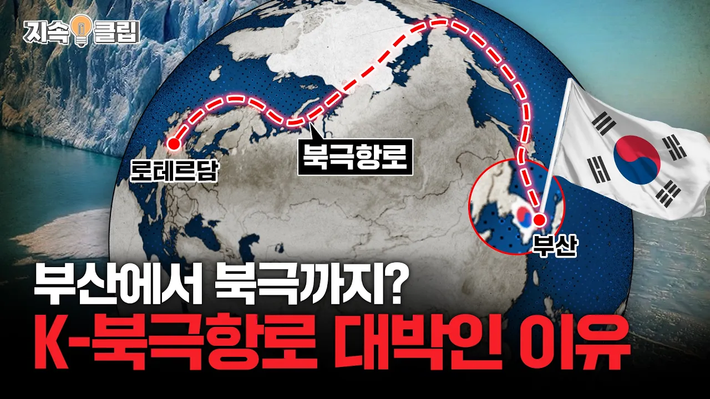

# 부산에서 북극까지?! 새로운 대항해시대 “북극항로”의 출발지, 대한민국?! | 지속클립

## 기본 정보
- **URL**: https://www.youtube.com/watch?v=EUq4nXTIMp0
- **채널명**: Hanwha
- **구독자수**: 18만
- **조회수**: 244,188
- **업로드일**: 2025-11-21
- **영상 길이**: 14:56
- **댓글 수**: 211
- **좋아요 수**: 4,369

## 썸네일

---

## 댓글 (추천순 TOP 10)

| 순위 | 좋아요 | 댓글 |
|------|--------|------|
| 1 | 90 | 꽁꽁 얼어붙은 북극해로 한화오션이 돌아다닙니다🚢🚢 |
| 2 | 84 | 한화오션 계속 흥해라!! |
| 3 | 92 | 응원합니다 대한민국 |
| 4 | 3 | 단군 할아버지 몇 수를 내다보신겁니까?! |
| 5 | 34 | 반드시 대한민국은 부산에서 북극 항로를 제일번으로 만든다 ᆢ |
| 6 | 47 | 드디어 대한민국에 북극항로!!!!!!! |
| 7 | 12 | 이 작은 나라에 다방면으로 세계제일인 분야가 많다는게 참 미스테리네요.대한민국 국민인게 뿌듯하네요. |
| 8 | 50 | 북극여행도 조만간인가요? 쇄빙선좀 많이 팔아주세요 |
| 9 | 21 | 엔진을 끄고 원자력 쇄빙선의 인도로 북극해를 지난다면 환경을 보호할수있다 |
| 10 | 31 | 역시 국익을 우선시하는 상남자 기업 한화 |
