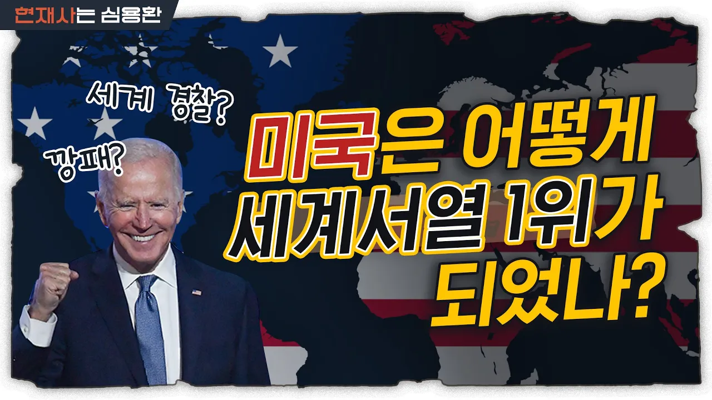

# 미국이 세계 경제를 장악한 방법 | 미국은 왜 가난한 나라를 도울까? [Eng]

## 기본 정보
- **URL**: https://www.youtube.com/watch?v=g-9yCNGYtRM
- **채널명**: 현재사는 심용환
- **구독자수**: 22만
- **조회수**: 348,662
- **업로드일**: 2021-11-11
- **영상 길이**: 14:54
- **댓글 수**: 417
- **좋아요 수**: 4,535

## 썸네일

---

## 댓글 (추천순 TOP 10)

| 순위 | 좋아요 | 댓글 |
|------|--------|------|
| 1 | 18 | 내가 세상을 살아가면서  깨달은 진리 '이유없고 대가없는 호의가 없다' |
| 2 | 17 | 자본주의의 끝판왕 미국 ..  뭐든 계획하에 완벽한 이익만 생각하고  움직이는 천재국가.. |
| 3 | 55 | 미국이 이끄는 세계질서 그걸 거역할순없어.... 명연설이떠오르네 |
| 4 | 0 | 노무쿤... |
| 5 | 0 | 동네 힘센 사람이... |
| 6 | 345 | 미국이 절대적인 정의는 아닐 수 있지만, 역사랑 지금까지 존재했던 국가중 가장 호의적인 패권국인건 팩트. 어차피 한국은 태생적으로 최강국이 될 수 없고 그런 상황에서 세계 힘을 쥐고 있는 나라랑 최우방이 되는게 한국 국익을 위해서도 나은 선택. |
| 7 | 0 | 한중일 경제-군사 동맹이 이루어질 수 있다면 미국 쌉발라버릴 수 있긴함... 근데 솔직히 한중일이 진심으로 연합한다? 상상조차하기 어려운 개념이긴래요😅😅 유럽은 수천년동안 서로 싸워왔으면서도 UN과 NATO로 경제-군사 동맹이 된게 신기해요. |
| 8 | 1 |  @LEEkyouho  무슨 한중일이냐? 한중 vs 미일이지 |
| 9 | 0 | 일본은 한국이 충분히 이긴다 |
| 10 | 1 |  @彭德懷-x5d  << 대깨문 국뽕아재 |
