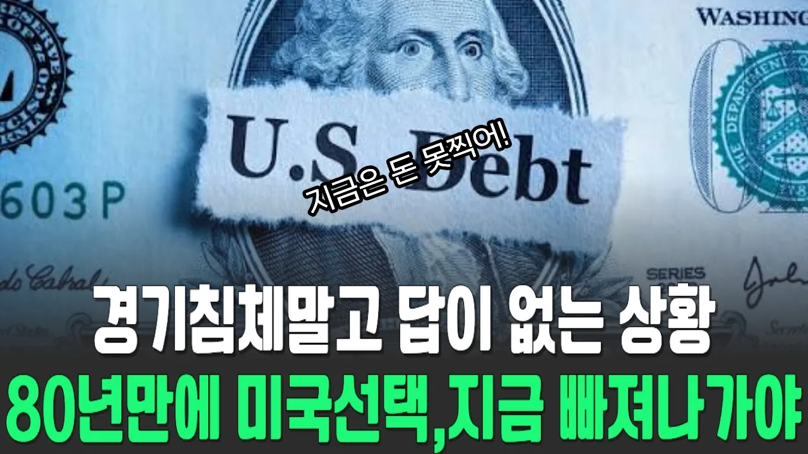

# 80년만에 미국 재정파탄과 경제붕괴시작 이미 통제불능상태

## 기본 정보
- **URL**: https://www.youtube.com/watch?v=v7N0AhEJ8fE
- **채널명**: 딥다이브경제
- **구독자수**: 2만
- **조회수**: 3,393
- **업로드일**: 2026-07-05
- **영상 길이**: 12:40
- **댓글 수**: 13
- **좋아요 수**: 272

## 썸네일

---

## 댓글 (추천순 TOP 10)

| 순위 | 좋아요 | 댓글 |
|------|--------|------|
| 1 | 2 | 전쟁을 더 하겠네 |
| 2 | 2 | 와우 감사합니다🎉 |
| 3 | 2 | 정확한 정보 신뢰가 갑니다 좋은정보에 감사드립니다  항상행복하세요 |
| 4 | 2 | 감사합니다 |
| 5 | 1 | 빚을 빚으로 돌려막기하는 카드깡하는 천조국...., 빚이 3경이 넘으니까 조만간... 천경국 이라고 불러야 할듯 |
| 6 | 2 | 재정파탄을 스테이블코인으로 돌파한다고 말하는 유투버들이 있는데 어떻게 생각합니까?코인이 미국채를 기반으로 발행한다고 합니다 |
| 7 | 0 | 달러스테이블코인??? |
| 8 | 0 | 미국은 구조조정 해야하고 금리 17%까지 올려야하고   아시아에서 전쟁한판 뜨긴해야할듯 |
| 9 | 0 | ai거품이 빠진다고들 하는데 ai가 무너지면 미국 패권과 미국경제에 치명타이기에 미국정부는 무슨 수를 써서라도 떠받치려하지 않을까. 그리고 미국을 대신할 경제는 사실 지구에 없음 |
| 10 | 1 | 이 방송은 공포 마케팅... 달러 스테이블 코인을 언급하라.. 이를 통해 강달러로 가고 있다. 달러 인덱스는 자꾸 오른다. 달러 패권 재 100년이 열리고 있다. |
