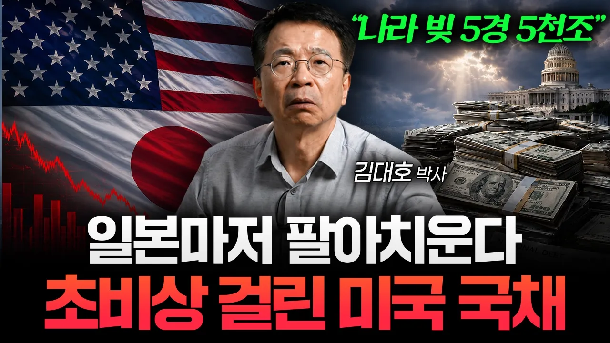

# "믿었던 일본마저..." 미국 국채 금리 붕괴 시나리오 (김대호 박사 1부)

## 기본 정보
- **URL**: https://www.youtube.com/watch?v=t_CtC8MTBqE
- **채널명**: 머니인사이드
- **구독자수**: 216만
- **조회수**: 427,155
- **업로드일**: 2026-08-28
- **영상 길이**: 28:42
- **댓글 수**: 219
- **좋아요 수**: 2,780

## 썸네일

---

## 댓글 (추천순 TOP 10)

| 순위 | 좋아요 | 댓글 |
|------|--------|------|
| 1 | 17 | 📗김대호 박사님 저서 《돈의 질서》
 http://product.kyobobook.co.kr/detail/S000219811328
 
 [타임라인]
 00:00 출연진 인사
 00:16 “나라 빚이 5경 원” 빚 폭탄에 깔린 미국 상황
 03:38 미국 빚이 눈덩이처럼 불어난 이유
 07:18 지금 미 국채 금리가 통제 불가능한 이유
 12:57 “중국에 이어 일본까지…” 미국 국채를 내던지는 이유
 16:56 미국과 일본이 엔화 살리기에 힘쏟는 이유
 20:13 빚 돌려막는 미국, 트럼프의 마지막 승부수는?
 26:54 미국발 빚 폭탄, 한국은 이렇게 해야 합니다 |
| 2 | 0 | 😊😊😮 |
| 3 | 0 | 지금 대미 교약비중은 전체의 17%대에 불과! 이제 미국의 분뇨는 개량된장,개량간장이 아님을 깨달을 때도 됐건만 ㅉㅉ~ |
| 4 | 0 | 대한민국이 미국 걱정하는거나 서민이 재벌 걱정하는 얘기가 혹시 아닌가요 |
| 5 | 29 | 빙하 녹아 굴러떨어져 미국판 경제위기 굴러 떨어져 지구촌 인간들이 이래저래 못살겠구나 ... |
| 6 | 21 | 29분이 엄청 몰입돼서 갔습니다. 머니인사이드 채널, 김대호 박사님 감사합니다. |
| 7 | 1 | 1929다음은  전에는. 두 개 답을 알아야 미래가. 보인다 |
| 8 | 15 | 나라돈을 니돈이냐 내돈이다 다빼먹엇구만잘햇어 잘햇어 아주잘햇어.... |
| 9 | 11 | 쉽게 설명해 주셔서 이해가 잘 되었습니다 |
| 10 | 20 | 올해 11월에 전 세계에 드리워진 모든 폭탄이 한꺼번에 터집니다.  트럼프는 중간선거 이기는 거에 모든 수단을 쓰겠지만,  그 이후에는 대책이 없습니다. |
