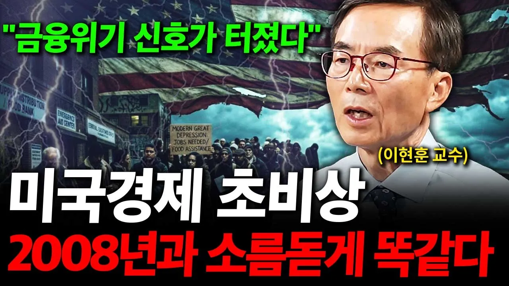

# 금융위기 신호가 터졌습니다. 미국 경제 초비상인 진짜 이유. ( 이현훈 교수 )

## 기본 정보
- **URL**: https://www.youtube.com/watch?v=d30uNI5v_zg
- **채널명**: 경제 원탑
- **구독자수**: 54만
- **조회수**: 49,932
- **업로드일**: 2026-09-05
- **영상 길이**: 29:37
- **댓글 수**: 17
- **좋아요 수**: 439

## 썸네일

---

## 댓글 (추천순 TOP 10)

| 순위 | 좋아요 | 댓글 |
|------|--------|------|
| 1 | 2 | 📌 이현훈 교수님의 [이현훈 교수의 경제포럼] 보러가기
 👉 https://www.youtube.com/@%EC%9D%B4%ED%98%84%ED%9B%88 |
| 2 | 1 | 인사이트 있는 내용 참 좋네요  잘 듣고 갑니다  좋아요 누르고 갑니다 |
| 3 | 14 | 빚을 잔득있어면 좀 갚아야지 사고를 더치고 개판으로 운영한다...투기꾼에게 나라 맡기니깐 나라가 망한다. |
| 4 | 1 | 기술혁명은 반드시 과잉투자로 이어지고 버블이 형성되고 그 버블은 터진다  1929년은 3년에 걸쳐 2000년은 2년반에 걸쳐 터진다  어디서 터지냐 하면 주식시장에서 터진다 |
| 5 | 8 | 미국은  곧 망할듯 망할듯 하면서도 망하지않는다  미국 망하기기다린사람들 다 망했다 ㅎ  미국은 불사의 나라다  현혹되지 마시길 |
| 6 | 7 | 금융위기 언급하는거보니 미장기국채금리 조만간 하락하겠다. 환율1500원대일때 1600원, 그이상 간다고 다들 호들갑떨더니 순식간에 1350원. 미국장기국채금리도 조만간 하락으로 쏠리겠네. |
| 7 | 11 | 헛소리는 일기장에 써라 이양반은 금융위기 오기를 바라겟지 ....위기오면 내가 맞췃다 할걸...본인은 주식 다 팔도록 .... |
| 8 | 6 | 기우제 ㅋㅋ 이분 몇년전부터 말 반복 |
| 9 | 6 | 아.. 기우제 아직도 ... 이 아저씨도 상판이, 한성교, 간철수, 죄미니 닮아감. 물론 거품붕괴 온다. 근데 거울좀봐 아저씨. 이게 밥벌이가 되면 안되 ㅉㅉ |
| 10 | 5 | 5년이상 오차를 못맞추면 전문가라고 나오면 안된다 |
