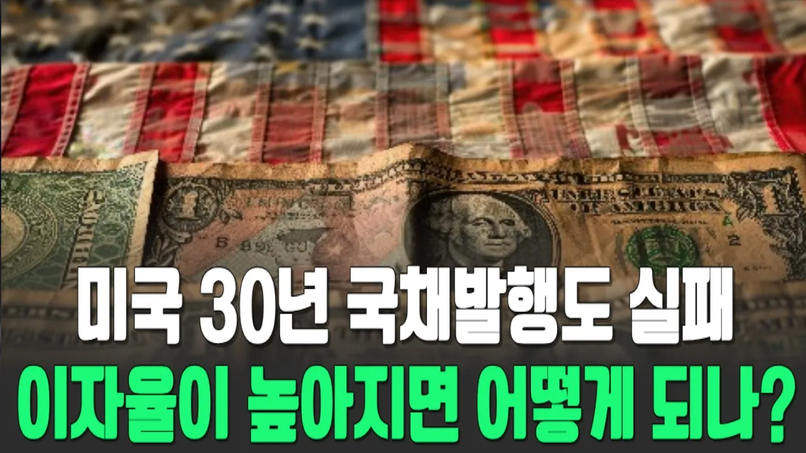

# 미국 30년채권발행에 문제가 생기다. 경제붕괴 신호탄

## 기본 정보
- **URL**: https://www.youtube.com/watch?v=WE2wF42L-A0
- **채널명**: 딥다이브경제
- **구독자수**: 2만
- **조회수**: 4,923
- **업로드일**: 2026-08-18
- **영상 길이**: 16:43
- **댓글 수**: 16
- **좋아요 수**: 297

## 썸네일

---

## 댓글 (추천순 TOP 10)

| 순위 | 좋아요 | 댓글 |
|------|--------|------|
| 1 | 1 | 감사드립니다  좋은정보에  항상응원합니다 |
| 2 | 3 | 실물경제를 말씀해 주셔서 감사합니다.  결국 수렴 해 가는것 같습니다.  ^^ |
| 3 | 10 | 미국은 국채를 발행야 하는대 받아주는 주체가 없다  유럽도 열받아서 팔고 캐나다 도 팔고 중국도 팔아 치운다  역대 각국 중앙은행 들이 금 으로 몰리니 금가격은 상승중이고  미 정부에는 돈이 없다 .. |
| 4 | 0 | 그래서 코인으로 대체 하려고 하죠 국채담보로 |
| 5 | 12 | 미국 정부의 국채 발행은 당장 눈 앞에 떨어진 핵 폭탄이지만, 그 핵 폭탄의 뇌관을 제거할 방법은 없다. 결국 선택할 것은 약 중소국을 잡아다 쥐어 짜서 폭발을 막으려 할 것이다. 그 대상은 대한민국, 대만, 일본 등이 될 것이고,,,, 거기다 더 한다면 캐나다, 멕시코, 베네수엘라 정도가 덧 붙여 질려나?? 정부는 미국에 투자하기로 한 자금 중단하고 철저히 무관심으로 일관하는 것으로 대응하고, 미국에서 얻어낼 수 있는 전시 작전권, 핵잠, 우라늄 재처리 등 당장 미국에서 반드시 얻어 내야 할 것들을 얻어 낸 다음 결정하면 된다. 투자 하더라도, 필요시 즉시 자금으로 회수 가능한 것에 투자 하고,,, 장기 회수로 판단되는 것에는 투자 하면 안된다고 본다. 미국에 닥친 지금의 내리막은 최소한 2038년 정도나 되어야 바닥 찍고 회복으로 접어 들 것으로 보는 바 지금은 미국에 대한 어떤 것도 추진해선 안되고 방관 내지는 무관심하게 지켜 보는 게 최선이라 생각한다. |
| 6 | 1 | 참 감사한 방송입니다. 다만.......... 활은 활시위를 떠났고... 결정만 해야하죠... 극복할 것인가? 사그라질것인가? |
| 7 | 3 | 변동성이 심해서  근원CPI로 꺼드럭댈꺼면 그냥 돌멩이를 CPI에 넣어라. |
| 8 | 0 | 팍팍 올라서 사기 시작 |
| 9 | 0 | 지금 5.32임 |
| 10 | 1 | 진짜 문제는 그 ai산업도 지금이 거품기라는 것 거품이 꺼졌을 때의 미국 경제가 받을 타격과 소수의 생존자를 바탕으로 시장이 재편되었을 때의 상황에 대해서도 다뤄주시면 고맙겠습니다   쇠락해가는 제국 미국과 함께 행보를 맟추는 어리석은 정치권력이 더는 집권하지 않기를 |
