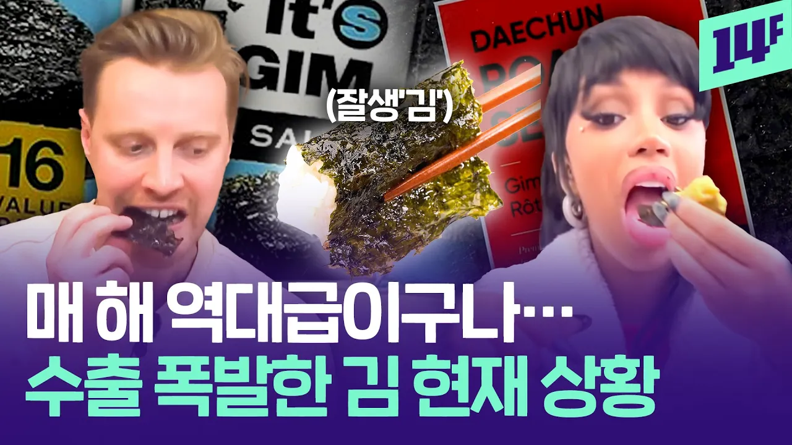

# 중국과 일본도 있는데… 왜 K-김이 제일 잘 팔릴까? / 14F

## 기본 정보
- **URL**: https://www.youtube.com/watch?v=jj8A7DlkZUc
- **채널명**: 14F 일사에프
- **구독자수**: 239만
- **조회수**: 109,861
- **업로드일**: 2026-01-20
- **영상 길이**: 2:57
- **댓글 수**: 358
- **좋아요 수**: 1,650

## 썸네일

---

## 댓글 (추천순 TOP 10)

| 순위 | 좋아요 | 댓글 |
|------|--------|------|
| 1 | 68 | 고작 간식으로 먹겠다고 우리 밥 반찬이 비싸지다니!...했는데, 약으로 먹는다니 할 말이 없네.... |
| 2 | 169 | 김 값 오르니 김밥, 삼각김밥 가격 다 올랐고 계속 오르고 있음 |
| 3 | 1 | 김밥 1줄에 들어가는 김은 80원에서 120원이 됬을뿐.. 몇천원 올린건 이때다싶어서 올린것뿐.. |
| 4 | 0 | 1도5천억이나 수출했으니 |
| 5 | 295 | 고마해... 너무비싸졌어... |
| 6 | 13 | 한국 반도체 세계 점유율 70%... 김도 70% ....그래서 검은 반도체라고..... ㅋㅋㅋㅋ |
| 7 | 2 |  @너른마당-d1c  반도체 전체가 70퍼센트가 아니고 메모리 반도체만 해당됨... 비메모리는 좀 상대적으로 낮은편 |
| 8 | 3 | 예전엔 드립이였지만 이젠 진짜야...... 해외로 그만보내 |
| 9 | 1 | 김은 안돼~~이제 그만 ㅠㅠ |
| 10 | 323 | 대전에 유명한 성경김이라는 업체가 있음 고등학교 졸업하고 알바했던 곳인데 대학교 겨울방학때 마다 알바하는데 몇년 사이에 작업량 엄청늘어남 공장도 하나 더 짓는걸로 알고있음 그리고 지도표 성경김이 풀네임인데 여기 상표가 대한민국지도임 독도 딱 박아놔서 일본에 수출 못 한다는 소문듣기는 했는데 쨌든 독도도 안지우고 독도 에디션도 판매함 |
