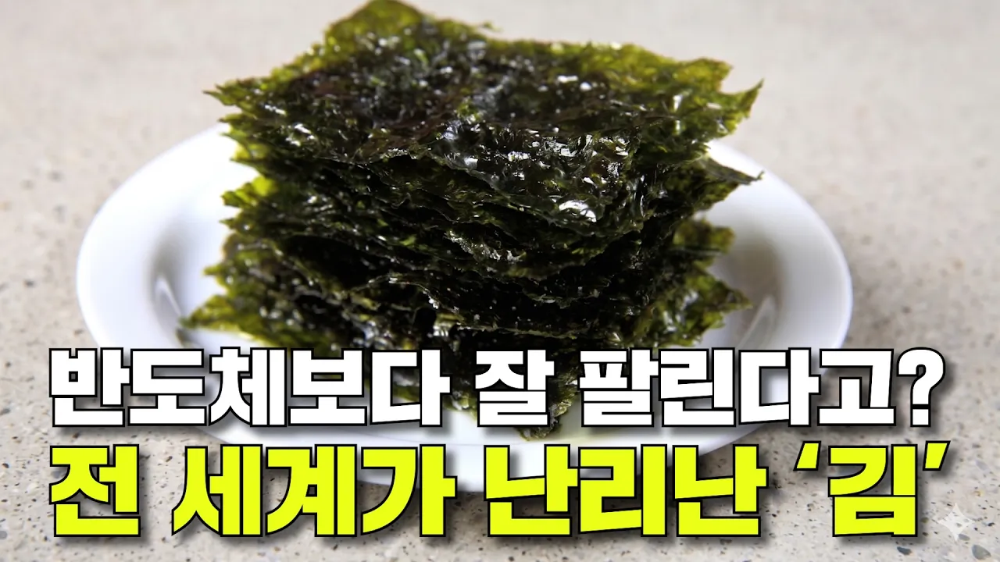

# 한국 김이 해외에서 없어서 못 판다고? 전 세계가 반해버린 '한국 김'

## 기본 정보
- **URL**: https://www.youtube.com/watch?v=oY3WZCp_k4Q
- **채널명**: 리뷰엉이: Owl's Review
- **구독자수**: 186만
- **조회수**: 121,402
- **업로드일**: 2026-04-25
- **영상 길이**: 10:02
- **댓글 수**: 508
- **좋아요 수**: 2,520

## 썸네일

---

## 댓글 (추천순 TOP 10)

| 순위 | 좋아요 | 댓글 |
|------|--------|------|
| 1 | 117 | 수출하는건 좋은데 김이 점점 비싸져요ㅜ.ㅠ..... 우리가 먹을게 없어요ㅠ |
| 2 | 30 | 자취생들 입장에선 천재지변이야 ㅠㅠ |
| 3 | 19 | 가장 중요한 부분하나가 빠졌는데  바로 요오드 성분이 있다는거임 우리나라야 해초류 워낙 많이 먹으니 모르겠지만  외국 애들은 요오드 성분 먹을려면 약으로 섭취해야함 근데 김이 싼가격에 간식으로 나와버리니 인기가 더 오른거… |
| 4 | 23 | 고산지대에선 요오드부족으로 고생들했는데 김덕분에 요드부족이해결되어 약국에서도 판다고 합니다 |
| 5 | 413 | 하정우 김 먹방하는 황해 리뷰였습니다. |
| 6 | 13 | 이거였네 |
| 7 | 8 | 와아앙 냠 |
| 8 | 0 | ㅋㅋㅋㅋㅋㅋㅋㅋㅋㅋㅋㅋㅋㅋㅋ |
| 9 | 0 | 황해에서 김이 많이나요 ㅎ |
| 10 | 0 |  @LF-Stealth  서해에서 나는거죠 |
