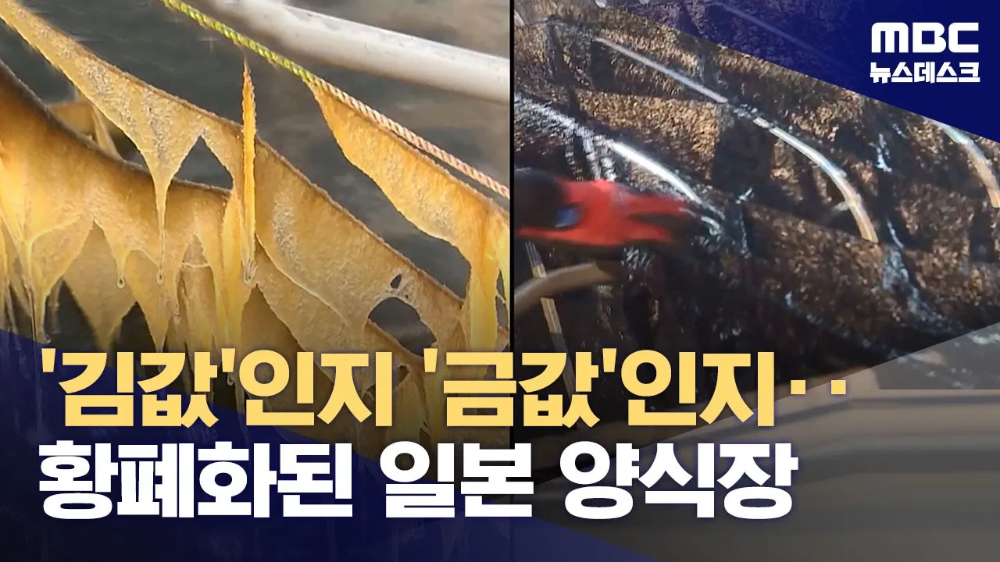

# 4가지 충격파에 일본 김 휘청, 김 뜯어먹는 물고기도 출현 (2024.05.14/뉴스데스크/MBC)

## 기본 정보
- **URL**: https://www.youtube.com/watch?v=Sy6vg-_GJj0
- **채널명**: MBCNEWS
- **구독자수**: 620만
- **조회수**: 357,091
- **업로드일**: 2024-05-14
- **영상 길이**: 3:26
- **댓글 수**: 1,000
- **좋아요 수**: 2,574

## 썸네일

---

## 댓글 (추천순 TOP 10)

| 순위 | 좋아요 | 댓글 |
|------|--------|------|
| 1 | 102 | 삼겹살도 일본 애들이 막 사들이기 시작해서... 원래 한국 물량만 있었는데 일본애들이랑 경쟁하더라고... |
| 2 | 13 | 일본김은 방사능에너지를 보금은 명품김 아닌가 ㅋㅋㅋㅋㅋ |
| 3 | 10 | 우리먹을김도 부족한데  왜 수출하냐고요? 당장 김수출금지 시켜주세요! |
| 4 | 242 | 김 원물, 반제품 수출을 제한하고 완제품 김은 포장지에 독도 우리땅 표기해서 수출하는 것으로. |
| 5 | 5 | 님 천재인듯~ |
| 6 | 2 | 성경김 포장지에 독도있어서 일본수출 못한다는데 |
| 7 | 1 | 만주는 한국땅 |
| 8 | 4 | 일본은 한국땅 |
| 9 | 0 | 한국은 중국땅 |
| 10 | 76 | 유통업자들 장난치겠군 ㅎㅎ |
