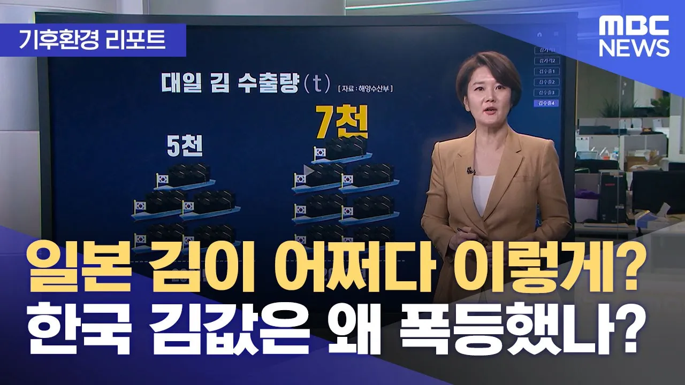

# [기후환경 리포트] 일본 김이 어쩌다 이렇게? 한국 김값은 왜 폭등했나? (2024.05.20/뉴스투데이/MBC)

## 기본 정보
- **URL**: https://www.youtube.com/watch?v=krQKVe05Tj4
- **채널명**: MBCNEWS
- **구독자수**: 620만
- **조회수**: 29,931
- **업로드일**: 2024-05-19
- **영상 길이**: 6:08
- **댓글 수**: 121
- **좋아요 수**: 395

## 썸네일

---

## 댓글 (추천순 TOP 10)

| 순위 | 좋아요 | 댓글 |
|------|--------|------|
| 1 | 10 | 전에 팜유 파동 났을때  물가 안정시킨다고 내수로만 돌린 나라 있었는데, 우리나라는 그러지 않을듯. 국민들은 김 비싸서 못먹더라도 수출에 집중하지 않을까 싶네. |
| 2 | 15 | 김밥도 이제 못먹겠군. |
| 3 | 33 | 핵페수도 영향을 줬을수도 있다... |
| 4 | 7 | 팜유 수출 규제 한 것처럼  , 우리나라 에서 생산된 김 수출을 가격 안정이 될 때까지 일정 기간 수출 제한합시다.  일본 걱정은 그만 하시고... |
| 5 | 4 | 김.. ㅠㅠㅠ 김도 이젠 비싸 |
| 6 | 9 | 자기들 앞바다에 핵폐수를 계속 방류하면서 바다가 안전하길 바란게 웃기는 일이지. 곧 우리나라도 저렇게 되리라 본다. 그때는 핵폐수 방류를 방인한 국힘당과  이 정권은 책임져야지. |
| 7 | 7 | 오염수 김이지 |
| 8 | 89 | 한국산 좋은김은 일본에 수출하고 국내 김 재고가 부족하자 해수부는 김 가격을 안정화 한다는 핑계로 일본산  핵 오염수 김을 9월까지 825톤 무관세로 수입해준다고 결정함.  일본인 김 먹일라고 김을 죄다 일본에 공수하니 국내김값이 치솟고 김값 낮춰보겠다고  방사능 김을 관세없이 수입해주겠다는 똑똑한 정부.. |
| 9 | 8 | ㅋㅋㅋㅋㅋㅋ 방사능 창조 경제 10r |
| 10 | 5 | 와우 역시 일본국 조선총독부 |
