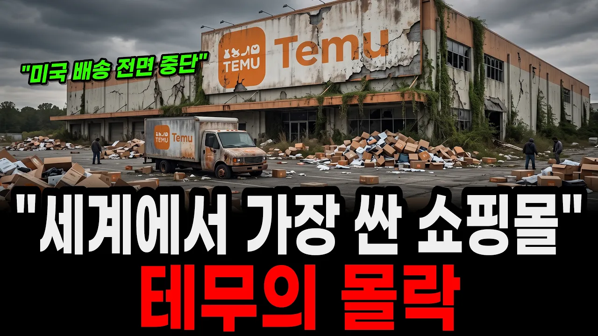

# 테무의 몰락, 세계에서 가장 싼 가게가 물건을 팔 수 없게 된 이유

## 기본 정보
- **URL**: https://www.youtube.com/watch?v=XSeAri9QOVs
- **채널명**: 똑똑한 경제학
- **구독자수**: 6만
- **조회수**: 948,600
- **업로드일**: 2026-09-12
- **영상 길이**: 23:35
- **댓글 수**: 626
- **좋아요 수**: 5,885

## 썸네일

---

## 댓글 (추천순 TOP 10)

| 순위 | 좋아요 | 댓글 |
|------|--------|------|
| 1 | 291 | 아무 검증도 안된 제품을 유통하는 업체 테무는 시라져야 할 1순위 업체. |
| 2 | 5 | 품질이 너무 안좋아요. 작동 한번 되는 것 같다가 그대로 망가짐. 옷도 사이트와 다른 재료와 디자인이고 한번 빨자 반으로 줄여듬 |
| 3 | 456 | 쓰레기 수입하는 국내 사업자들도 엄벌에 처해야 합니다 |
| 4 | 19 | 옳으신 말씀 꼭 정부가 해야할 일 ㆍㆍ울 동네 마트 가면 중국산 국내산 야채 있으면 비싸도 국내산 사서 안팔릴텐데 그래도 계속 들어오는거 보면 미스테리ㆍ안 팔리는것들 다 어디가나 |
| 5 | 5 | ​ @작은구름-j8r 그래도 사는인간들 있어요 |
| 6 | 6 | ​ @작은구름-j8r 정작 중국 가보면 과일이며 야채며 신선하고 맛있어요 품질도 좋습니다 결국은 한국수입업자들이 나쁜 놈들이었던 겁니다 |
| 7 | 0 | 지금 신선식품 이야기 하노? |
| 8 | 2 | ​ @역삼동김승우 중국배추. 관리하는거보고도 신선하다고 |
| 9 | 1 |  @역삼동김승우  예전에 중국산 왜 이렇게 품질 떨어지냐고 했더니 경제인이 수입업자가 품질 떨어지는 제품만 수입해서 그렇다고 한 말이 떠오르네요. |
| 10 | 3 | 쿠팡에 개인판매자들이 알리 테무에서 물건들여와서 팔고있음 90% 로켓후레쉬빼고는 |
