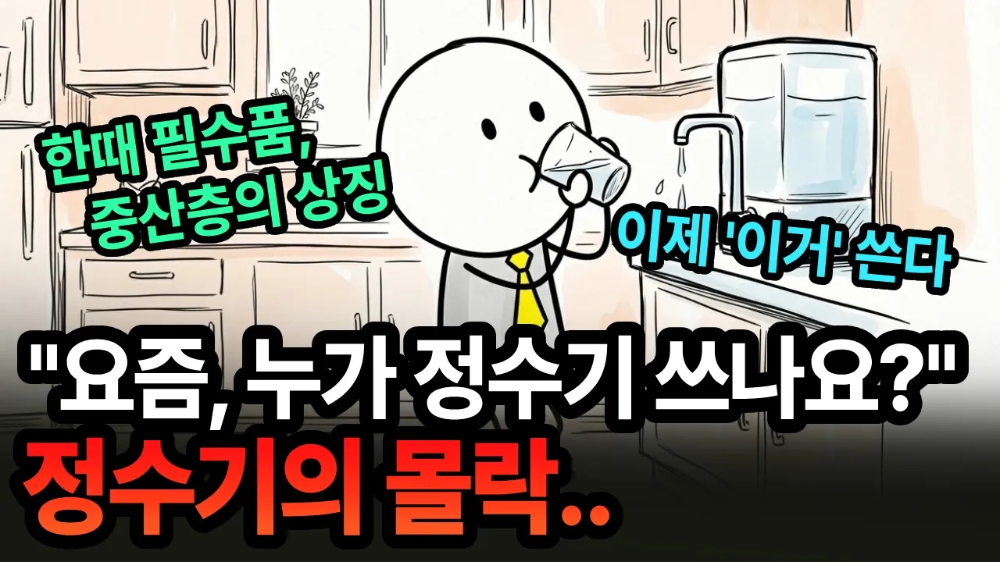

# "정수기 물 안 마십니다" 정수기가 몰락하는 진짜 이유 | 경제 애니메이션

## 기본 정보
- **URL**: https://www.youtube.com/watch?v=k1izz75XnXY
- **채널명**: 경제의 시작
- **구독자수**: 1만
- **조회수**: 370,358
- **업로드일**: 2026-09-16
- **영상 길이**: 22:28
- **댓글 수**: 399
- **좋아요 수**: 4,176

## 썸네일

---

## 댓글 (추천순 TOP 10)

| 순위 | 좋아요 | 댓글 |
|------|--------|------|
| 1 | 60 | 물 끊여먹을란다 |
| 2 | 70 | 수돗물에 옥수수 볶은거 넣고 끄려먹는데 옥수수차 조아요 |
| 3 | 3 | 여름에 더운데 물 끓이는것도 장난 아니고 중요한건 끓인물 너무 빨리 먹어서 자주 끓여야하는 불편함이 정수기를 사용하게 되더라구요 |
| 4 | 0 | 옥수수차는 쉰거같은 냄새가나서 보리차많이끓여서 냉장고에 물은 보리차가 최고입니다. 생수도 꼭 필요하긴합니다😅 |
| 5 | 31 | 직수 정수기 필터 직접교체 1년 3만ㅅ천이면 됨 |
| 6 | 81 | 정수기 한달 만원내고 냉.온수기기능있으면 믹스커피타먹거나 컵라면 먹더라도 편리성은있음. |
| 7 | 18 | 뭐지?? 생수 안사도 되고 생수병 분리수거 않아도 되고  전기포트 따로 안둬도 되고 물 언제 끓나 안기다려도 되고 여름엔 시원한물 겨울엔 그때그때 필요한 온도의 물. 정수된 물로 얼린 깨끗한 얼음. 정수기 없는 일상은 상상도 하기 싫은뎁 ㄷ |
| 8 | 11 | 정수기를 새로운 시선으로 보게되네요. |
| 9 | 10 | 인생 즉 삶도 이와 같습니다 |
| 10 | 22 | 뭔 간단하게 끝날 것을 반복 설명하면서 보기 싫어지게 만드네... |
