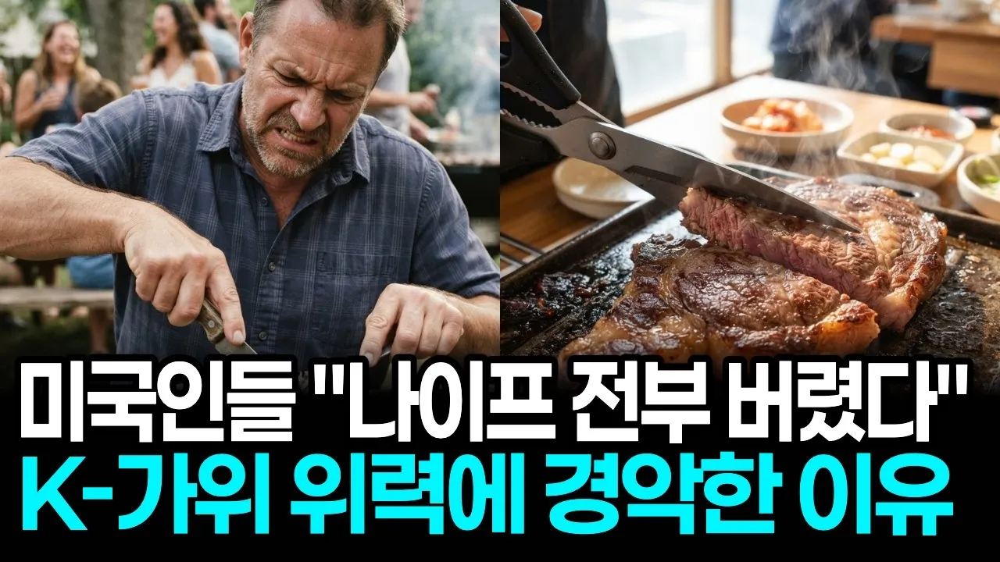

# "나이프 전부 쓰레기통에 버렸습니다" 바비큐 파티하던 미국 현지인들이 한국산 고깃집 가위에 경악한 이유

## 기본 정보
- **URL**: https://www.youtube.com/watch?v=inyRAYXe7Ms
- **채널명**: 칩스앤뉴스
- **구독자수**: 4,970
- **조회수**: 156,829
- **업로드일**: 2026-09-16
- **영상 길이**: 19:20
- **댓글 수**: 44
- **좋아요 수**: 1,256

## 썸네일

---

## 댓글 (추천순 TOP 10)

| 순위 | 좋아요 | 댓글 |
|------|--------|------|
| 1 | 24 | 도구의 인간 너희도 손에서  칼, 이제 가위까지 진화했구나 |
| 2 | 2 | 서양인들중엔 아직도 가위로 음식을 자르는걸 미개하다 생각하는 사람 있을걸요. |
| 3 | 18 | 통쾌하다 한국의 발상이 전세계를 바꾸는 시작이라는걸 |
| 4 | 7 | 접시나 도마위에 올려서 포크와 나이프로 자르는 방식과 주방가위와 주방집게로 들고 자르는 방식은 차이가 매우 클수밖에 없는 이유 |
| 5 | 11 | 손질은칼.삼겹살은 가위로.싫으면말고.. |
| 6 | 10 | 간편과 효율성 및 고기에 대한 사랑이 반영 |
| 7 | 3 | 주방가위는 평화가 최고입니다. 가격도 싸고 품질도 최고입니다. 상표명은 평화 혹은 peace입니다. |
| 8 | 8 | 이거 진짜 빵 터졌다 ㅎㅎㅎㅎ 🎉 |
| 9 | 5 | 한국의 고기용가위 시작은 아이러니 하게도 양복점이나 양장점, 봉제공장 등에서 사용하던 강철제의 무겁고 칼날만큼 날카로운 양장가위 였어요. 70년대 서울시내 고깃집들에서도 대부분 그 양장가위를 사용해서 불판위의 고기을 자르고는 했죠. 아직도 몇몇 음식점들에서는 양장가위를 사용하고 있지요. |
| 10 | 17 | 칼은 사용할수록 무뎌지지만 가위는 사용할수록 날카로워져 더 잘 잘린다 (단 너무 단단한 것을 자르면 가위날이 무뎌진다) |
