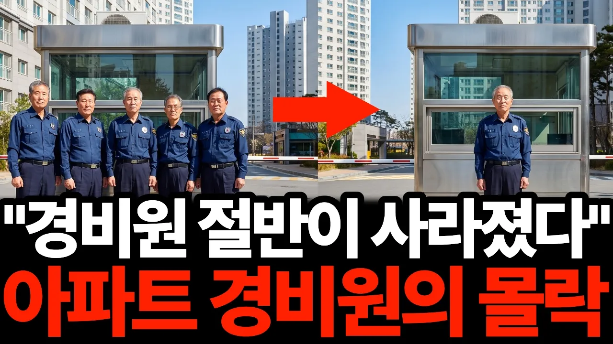

# "36명이던 아파트 경비원이 15명이 됐습니다…" 아파트 경비원들이 하나둘 사라지는 진짜 이유

## 기본 정보
- **URL**: https://www.youtube.com/watch?v=04fcgx9KkCo
- **채널명**: 투자한잔
- **구독자수**: 1,610
- **조회수**: 191,040
- **업로드일**: 2026-09-06
- **영상 길이**: 30:11
- **댓글 수**: 103
- **좋아요 수**: 2,187

## 썸네일

---

## 댓글 (추천순 TOP 10)

| 순위 | 좋아요 | 댓글 |
|------|--------|------|
| 1 | 25 | 관리비 월 1만 원 절약 vs 경비원 그대로 유지.  여러분이 실제로 주민 투표를 해야 한다면 어느 쪽을 선택하시겠어요?  그리고 지금 사는 아파트도 예전보다 경비원이 줄었는지 궁금합니다. |
| 2 | 7 | 경비원  노는것같지만, 직접 해봐라, 남의돈 먹기가 쉽지않다, 세상에 쉬운일은 없다, 경비원  너무 욕하지마라, 그리고 관리상 관리소장도 꼭필요하다, 그리고 니가 볼때 노는것 같지만, 경비원도 가끔  앉아있을 시간이 필요하다 , 인간은 기계가 아니니까,  오죽 못났으면 경비원 필요없다는 인간들,,,,,,,,,,,,,,,,, |
| 3 | 0 | 경비시군 |
| 4 | 28 | 30년전 지어진 서민아파트...경비원 숫자는 1/2로  줄었는데 ... 남겨진 경비원이 하는일은  경비원 줄인 숫자 이상  증폭.. |
| 5 | 5 | 경비.. 분리수거하려고 두는건 말이안됨. 분리대있고 각자 갖다버리면 되고 아파트주변 각자 깨끗이 사용하면되고.. |
| 6 | 39 | 다단계 하청만 없애도 관리비가 대폭 내려가요 |
| 7 | 9 | 경비 줄이고 관리비올리고... |
| 8 | 49 | 요즘 아파트 산책도 위험해 지고 있다. 어둠이 내린후 경비원의 순찰이 꼭 필요한 시대가 되었다. 산책로 순찰은 주민 안전과 직결되고 있다. 경찰은 아파트 안전에 관심이 없다.. |
| 9 | 9 | 아파트 단지는 사유지인데 겡찰이 들어가 지키는 건 불법이라서~ 고소 고발, 사건이 나면 모를까,,, 기래서 겡비를 쓰는 거, |
| 10 | 1 | 단지내 카메라가 있는데 .. 경비원이 따라다니는 것도 아니고 ..ㅋ |
